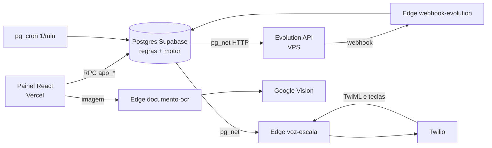

# Análise crítica da topologia e do banco

Feita em 26/09/2026. Cobre desempenho, estrutura do banco, relações, a questão dos microserviços
e o que foi corrigido na migration 39.

## Resumo

| Pergunta | Resposta |
|---|---|
| O banco tem bom desempenho? | **Sim, medido.** Com um ano de operação simulado, as consultas levam de 8 a 76 ms. Não é o gargalo |
| As relações estão bem modeladas? | **Sim, no essencial.** Modelo normalizado, chaves e restrições corretas. Os problemas estão em como o **tempo** é guardado e em pontos de higiene |
| Vale separar em microserviços? | **Não.** Para uma equipe de uma pessoa, multiplicaria deploys, custos e pontos de falha. A exceção útil é isolar o **provedor de WhatsApp** num adaptador (seção 3) |
| O que é grave? | Um bug de fuso que impedia o envio de escalas marcadas para as 3 horas seguintes, e o repositório não refletir o que está em produção |

## Como foi analisado

- Leitura das 38 migrations, das Edge Functions e do painel.
- Testes no projeto de **homologação** (`infoxtec-escalas-dev`), com dados simulados gravados e
  desfeitos na mesma transação. **A produção não foi acessada.**
- Relatórios de desempenho e segurança do próprio Supabase (advisors) sobre a homologação.

## 1. Desempenho

Volume simulado: 200 técnicos, 52 mil escalas (um ano), 156 mil mensagens e 52 mil eventos de
auditoria.

| Consulta | Quem usa | Tempo |
|---|---|---|
| `vw_acoes_pendentes` | Motor, 1 vez por minuto | 71 a 76 ms |
| `vw_ligacoes_pendentes` | Motor, fase de ligações | 43 a 51 ms |
| `vw_escalas_painel`, 15 dias | Agenda do painel | 40 ms |
| `vw_escalas_painel`, 30 dias | Agenda do painel | 70 ms |
| `fn_painel_locais` | Painel por local | 23 ms |
| `fn_pendencias_escala` | Alerta das 16h/18h | 8 ms |
| `fn_calcular_jornada` | Cada escala criada | 0,74 ms (500 linhas importadas ≈ 0,4 s) |

**Conclusão:** folga de pelo menos dez vezes o volume atual. As views do motor percorrem todas as
escalas abertas e buscam a última mensagem de cada uma. Isso só vai pesar com algumas centenas de
milhares de escalas; quando chegar lá, a saída é um índice parcial por status e arquivar escalas
antigas, não trocar de arquitetura.

## 2. Estrutura do banco

### Pontos fortes

- Modelo normalizado: `tecnicos`, `locais`, `escalas`, `notificacoes`, `respostas`,
  `ocorrencias`, com chaves estrangeiras e `on delete` coerentes.
- Índice único parcial impede dois horários iguais para o mesmo técnico e ignora as canceladas.
- Auditoria automática por gatilho (`escala_eventos`), com o autor da mudança.
- Enums para status, `check` em telefone e prioridade.
- RLS ligado em todas as tabelas e acesso só por funções que conferem o papel.

### Problemas

**Tempo local sem fuso (crítico, corrigido na 39).** A escala guarda `data_servico` (date) e
`hora_inicio` (time), que são hora local da Bahia. As views do motor comparavam
`data_servico + hora_inicio` com `now()`. Como o servidor roda em UTC, o Postgres tratava a hora
local como se fosse UTC. Testado na homologação às 11h52 da Bahia:

| Escala marcada para | Antes da 39 | Depois da 39 |
|---|---|---|
| +1 hora | **não aparecia para o motor** | enviar_primeira |
| +2 horas | **não aparecia para o motor** | enviar_primeira |
| +4 horas | enviar_primeira | enviar_primeira |
| Começou há 10 minutos | fora | fora |

Na prática: **escala criada para as próximas 3 horas nunca era enviada**, e lembretes, alerta ao
supervisor e ligação paravam 3 horas antes do início. A 39 compara hora local com hora local,
calculada uma vez por execução. O mesmo desvio existe no webhook (`fn_wh_mensagem`): a resposta
"1" solta vale para escalas até 9 horas depois do início, não 12. Fica para a migration de
sincronização (seção 4), porque essa função é grande e pode divergir da produção.

**Recomendação de longo prazo:** guardar o início como instante (`inicio_em timestamptz`, gerado
a partir da data e hora) e usar essa coluna em tudo que compara com o relógio.

**Estados sem fluxo automático.** `em_execucao` e `concluida` dependem de clique no painel;
`rascunho` e `reagendada` não são usados. Na prática, escala passada fica `confirmada` para
sempre, o que limita indicadores de execução. Decisão de negócio: fechar automaticamente depois do
término previsto, ou manter manual.

**`config` sem validação.** Os parâmetros são texto convertido na hora do uso. Um
`update config set valor = 'abc' where chave = 'max_tentativas'` quebra o motor a cada minuto,
sem aviso. Recomendação: função de gravação que valida o tipo, ou `check` por chave.

**Campo legado.** `escalas.duracao_prevista_min` perdeu sentido com a jornada CLT calculada; o
painel ainda envia 480 fixo.

**Duas tabelas de pessoas.** Supervisores são linhas de `tecnicos` (`is_supervisor`) e usuários do
painel ficam em `painel_usuarios`, por e-mail. Funciona, mas a mesma pessoa pode estar nos dois
cadastros com dados diferentes. Aceitável no tamanho atual.

**Índices.** O Supabase aponta 10 chaves estrangeiras sem índice; nenhuma pesa nesse volume.
`idx_notif_wa` duplica o índice que a restrição `unique` de `notificacoes.wa_message_id` já cria
e pode ser removido.

**Logs sem retenção (corrigido na 39).** `webhook_eventos` guarda o conteúdo de todas as
mensagens recebidas, e o `pg_cron` grava 1.440 execuções por dia. A limpeza era manual.

## 3. Topologia e a questão dos microserviços

**Por que não microserviços.** Hoje há um núcleo (o banco) e três funções finas. Separar escalas,
mensagens, voz e documentos em serviços próprios traria chamadas de rede entre eles, autenticação
entre serviços, deploys coordenados e mais contas para pagar, sem ganho: o volume é pequeno e a
equipe é uma pessoa. A decisão 1 (regra no banco) continua certa para este tamanho.

**Os pontos fracos reais da topologia:**

1. **O motor não isola falhas.** `fn_dispatcher_whatsapp` roda as fases 1 a 3 numa única
   transação, sem tratamento por escala. Um dado ruim numa escala (por exemplo, erro ao montar a
   mensagem) derruba a execução inteira, e como o `pg_net` também é transacional, nenhuma mensagem
   sai até alguém corrigir o dado. Correção: tratamento de erro por item, registrando a falha na
   própria notificação. Depende da sincronização da seção 4.
2. **O provedor de WhatsApp está embutido no SQL.** `fn_payload_escala` e `fn_evo_post` montam o
   formato e o endereço da Evolution. A migração para a API oficial da Meta, que é a primeira
   tarefa do Bloco 1 de [segurança e homologação](seguranca-homologacao.md), exigiria reescrever
   essas funções. Proposta: uma tabela de saída (`mensagens_saida`) que o banco preenche com o
   conteúdo neutro, e **uma** Edge Function que lê essa fila e fala com o provedor. Trocar a
   Evolution pela Meta vira mudança numa função. É o único "serviço" que vale separar, e deve ser
   feito junto com a migração para a Meta, não antes.
3. **Ninguém é avisado quando o motor falha.** Uma falha do dispatcher fica registrada em
   `cron.job_run_details` e em nenhum outro lugar. Recomendação: indicador na aba Operação e
   alerta ao supervisor quando a última execução bem-sucedida tiver mais de 5 minutos.

## 4. O repositório não reflete a produção

Duas evidências, as duas verificáveis no código:

1. **Ligações de voz.** O comentário da migration 25 diz que o corpo completo do dispatcher (fases
   1 a 6) foi aplicado direto no banco. No repositório, a última versão de
   `fn_dispatcher_whatsapp` (migration 19) **não chama** `fn_disparar_ligacoes`. Um banco montado a
   partir do repositório não faz ligações.
2. **Documentos.** No banco montado a partir do repositório, abrir ou enviar documento falha com
   `permission denied for function fn_papel` (testado). Em produção os documentos funcionam, então
   alguém ajustou a produção fora das migrations.

**Consequência:** qualquer migration que recrie `fn_dispatcher_whatsapp` a partir da versão do
repositório **desligaria as ligações em produção sem aviso**. Por isso a 39 não mexe no
dispatcher nem no webhook.

**Como resolver:** comparar as definições de funções, views e políticas da produção com as da
homologação, e escrever uma migration de sincronização que traga para o repositório exatamente o
que está em produção. Em produção ela não muda nada; na homologação ela completa o que falta.

## 5. Achados por prioridade

| # | Achado | Gravidade | Situação |
|---|---|---|---|
| 1 | Fuso: escalas das próximas 3 horas nunca enviadas | Crítica | **Corrigido na 39** (homologação) |
| 2 | Repositório diferente da produção (dispatcher e documentos) | Crítica para o processo | A fazer: depende da comparação |
| 3 | Política de documentos quebrada no repositório | Alta | **Corrigido na 39** |
| 4 | Motor sem isolamento de falha por escala | Alta | A fazer, depois do item 2 |
| 5 | `vw_ligacoes_pendentes` e tabelas com permissão para `anon` | Média | **Corrigido na 39** |
| 6 | Logs sem retenção | Média | **Corrigido na 39** + `setup/cron.sql` |
| 7 | Provedor de WhatsApp embutido no SQL | Média | Proposta: fila de saída + adaptador, junto com a API Meta |
| 8 | Motor falha em silêncio | Média | A fazer |
| 9 | `config` sem validação | Média | A fazer |
| 10 | Desvio de fuso no webhook (9h em vez de 12h) | Baixa | Junto com a sincronização |
| 11 | Estados sem fluxo, campo legado, índice duplicado | Baixa | A decidir |

## 6. A migration 39

Arquivo: `supabase/migrations/20260926150050_39_fuso_documentos_permissoes_e_limpeza.sql`.
Aplicada e testada na homologação.

| Parte | O que faz | Teste |
|---|---|---|
| Fuso | `vw_acoes_pendentes` e `vw_ligacoes_pendentes` comparam hora local com hora local | Escalas de +1h e +2h passam a aparecer; escala já iniciada continua fora |
| Documentos | Nova `app_pode_gerir_documentos()` (security definer) nas políticas do bucket | Admin lê; e-mail fora de `painel_usuarios` não lê |
| Permissões | Revoga de `anon` e `authenticated` todo acesso direto às tabelas e views do schema `public` | `anon` bloqueado na view e em `tecnicos`; 9 funções do painel testadas como admin |
| Limpeza | `fn_limpeza_logs()`: webhook 30 dias, alertas 90 dias, pg_cron 7 dias | Executa; sem permissão para `anon` e `authenticated` |
| Desempenho | Hora local calculada uma vez por execução | 76 ms, igual ao anterior (a primeira versão, com função por linha, levava 146 ms) |

### Aplicar em produção

A 39 é segura mesmo com a divergência da seção 4: não recria o dispatcher nem o webhook. Se a
produção tiver uma versão diferente das duas views, o `create or replace view` falha e o
`db push` desfaz tudo, sem efeito parcial.

1. Merge do PR em `main`.
2. Na máquina Linux: `npx supabase link --project-ref zpckrxydqqmmcrphrkxz`, conferir
   `supabase/.temp/project-ref` e rodar `npx supabase db push`.
3. No SQL Editor da produção, agendar a limpeza (linha nova de `supabase/setup/cron.sql`).
4. Voltar o `link` para a homologação.

**Efeito imediato:** escalas das próximas 3 horas que estavam presas serão enviadas no minuto
seguinte, se estiverem dentro da janela de envio.

## 7. Próximas etapas

| Etapa | O quê | Depende de |
|---|---|---|
| A | Migration 39 na homologação | **Feito** |
| B | Comparar definições da produção com a homologação | Autorização para ler só a estrutura da produção, ou rodar uma consulta e colar o resultado |
| C | Migration 40: sincronizar o repositório com a produção | B |
| D | Migration 41: isolamento de falha no motor, fuso no webhook, alerta de motor parado | C |
| E | Aplicar 39 a 41 em produção | Revisão e merge |
| F | Testes automatizados (pgTAP) para fuso, motor e permissões, rodando no CI | Fase 2 do [fluxo](fluxo-de-desenvolvimento.md) |
| G | Fila de saída e adaptador de WhatsApp | Junto com a migração para a API Meta |
