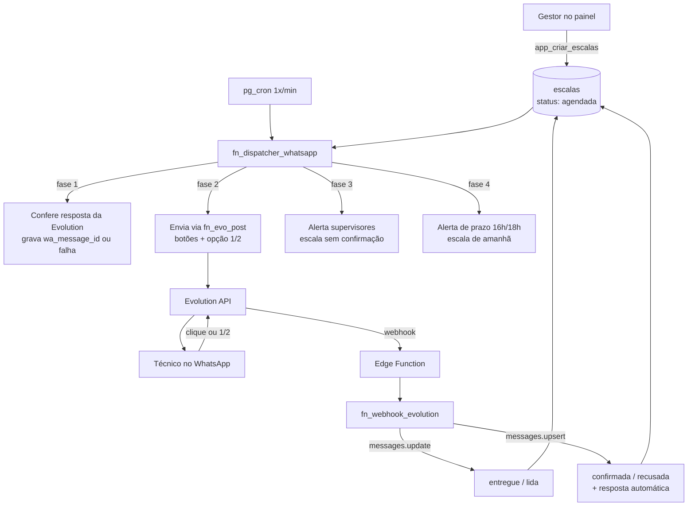

# Arquitetura

## Ideia central

**Toda regra de negócio mora no banco de dados.** O painel é uma vitrine: ele lê e escreve
através de funções do Postgres que conferem quem é o usuário e o que ele pode fazer. Nenhuma
regra vive só na tela.

Essa escolha tem um efeito prático que já se provou: mudanças de regra (jornada CLT, prazo de
envio, liberação de horário após cancelamento) entram em produção **sem deploy do painel**.

## Componentes

| Camada | Tecnologia | Onde roda | Custo |
|---|---|---|---|
| Painel | React 18 + TypeScript + Vite + Tailwind | Vercel (estático) | R$ 0 |
| Login | Supabase Auth (e-mail e senha) | Supabase | R$ 0 |
| Banco e regras | PostgreSQL 15 | Supabase | R$ 0 |
| Agendador | pg_cron, a cada minuto | Supabase | R$ 0 |
| Chamadas HTTP de saída | pg_net | Supabase | R$ 0 |
| Segredos | Supabase Vault | Supabase | R$ 0 |
| Webhook de entrada | Edge Function `webhook-evolution` (Deno) | Supabase | R$ 0 |
| WhatsApp | Evolution API 2.4 (instância `infoxtec`) | VPS própria | custo da VPS |

Projeto Supabase: `infoxtec-escalas` — ref `zpckrxydqqmmcrphrkxz`, região `sa-east-1`.

## Fluxo completo

## O motor de decisão

A view `vw_acoes_pendentes` responde, a qualquer momento: **quem precisa de ação agora e qual**.
O dispatcher é burro de propósito — lê a view e executa.

| Ação | Quando |
|---|---|
| `enviar_primeira` | Escala agendada, nunca enviada |
| `nao_recebeu` | Enviada há mais de `timeout_entrega_min` sem entrega |
| `reenviar` | Entregue ou lida há mais de `intervalo_reenvio_min` sem resposta |
| `reenviar_falha` | A Evolution recusou o envio |
| `escalonar` | Atingiu `max_tentativas` |

A view já filtra: técnico ativo e com `opt_in`, escala ainda no futuro, e horário dentro da
janela `janela_envio_inicio`–`janela_envio_fim`. Fora da janela, a view devolve vazio e nada sai.

## Por que o envio é em duas etapas

O `pg_net` é assíncrono: `fn_evo_post` devolve um número de requisição, não a resposta. Por isso:

1. **Fase 2** envia e grava a notificação como `enfileirada`, guardando `http_req_id`.
2. **Fase 1** da execução seguinte lê `net._http_response`, e só então marca `enviada` com o
   `wa_message_id` real, ou `falha` com o código e a mensagem de erro.

Consequência importante: o painel só mostra "notificada" quando a Evolution confirmou o envio.
O status nunca mente.

## Correlação das respostas

Três caminhos, nessa ordem:

1. **Botão** — o `id` do botão carrega o ID da escala (`conf:<uuid>` / `prob:<uuid>`).
2. **Resposta citando a mensagem** — `context.stanzaId` casa com `notificacoes.wa_message_id`.
3. **Texto solto** ("1", "2", "ok") — usa a escala pendente mais recente daquele técnico.

O telefone é normalizado por `fn_tel_canonico`: celulares do Nordeste chegam sem o nono dígito
(`557181776307`) e precisam casar com o cadastro (`5571981776307`).

## Jornada CLT

`fn_calcular_jornada(hora_inicio)` percorre a jornada minuto a minuto e devolve turno, minutos de
relógio, intervalo, minutos noturnos e hora de término. Um gatilho aplica isso em toda escala
criada ou editada, então vale também para a importação por planilha.

- 8 horas legais + 1 hora de intervalo (CLT art. 71)
- Hora noturna entre 22h e 5h vale 52min30s (CLT art. 73): 8h legais = 7h de relógio
- Jornada iniciada entre 22h e meia-noite segue reduzida após as 5h (Súmula 60 TST)

Tudo parametrizado em `config`. A regra deve ser validada pelo RH.

## O que NÃO existe de propósito

- **Sem servidor de aplicação**: o painel é estático, o banco é a API.
- **Sem fila de mensagens**: o `pg_cron` de 1 minuto com estado no banco cumpre o papel.
- **Sem cache no front**: os volumes são pequenos; a agenda recarrega sozinha a cada minuto.
- **Sem roteador de páginas**: são quatro abas controladas por estado.
