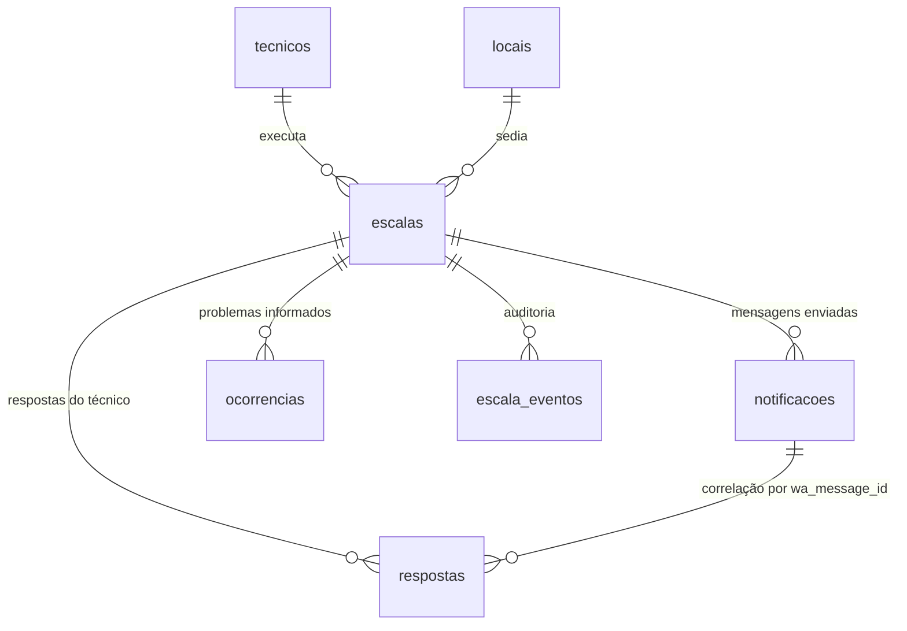

# Banco de dados

19 tabelas, 7 views, 92 funções (41 delas são a API `app_*`), 5 gatilhos e 1 agendamento.
Tudo versionado em `supabase/migrations` (01 a 35).

## Modelo



## Tabelas

| Tabela | Papel | Observações |
|---|---|---|
| `tecnicos` | Equipe de campo | `telefone_e164` único, só dígitos. `opt_in` controla envio; `is_supervisor` recebe alertas |
| `locais` | Obras e clientes | `link_maps` entra na mensagem do WhatsApp |
| `escalas` | Núcleo | Status, jornada calculada, auditoria. Índice único parcial: um técnico não tem duas escalas ativas no mesmo dia e hora — canceladas não contam |
| `notificacoes` | Uma linha por mensagem enviada | `wa_message_id` é a chave de correlação; `http_req_id` liga à resposta do pg_net |
| `respostas` | Cliques e mensagens do técnico | `wa_message_id` único garante idempotência do webhook |
| `ocorrencias` | Problemas informados | Motivo e detalhe enviados depois pelo técnico |
| `escala_eventos` | Trilha de auditoria | Quem mudou o quê e quando |
| `painel_usuarios` | Autorização | E-mail, papel (`admin`/`gestor`/`leitura`), ativo |
| `config` | Parâmetros operacionais | Muda comportamento sem deploy |
| `webhook_eventos` | Log bruto dos eventos da Evolution | A `apikey` é removida antes de gravar |
| `alertas_enviados` | Controle do alerta de prazo | Evita alerta duplicado no mesmo dia |
| `log_exclusoes` | Registro de exclusões definitivas | Não guarda nome nem telefone |
| `ligacoes` | Uma linha por ligação da URA | `call_sid` da Twilio, tecla digitada, duração e custo |
| `habilidades` | Catálogo do que o técnico sabe fazer | Não vence. NRs, CNH e ASO saíram daqui na migration 36 |
| `tipos_documento` | NR, CNH, ASO e outros documentos com validade | `palavras_chave` alimenta a classificação automática no envio em lote |
| `tecnico_documentos` | Validade de cada documento por técnico | Situação calculada em `vw_tecnico_documentos` |
| `tipo_atividade_documentos` | Documentos exigidos por tipo de atividade | Documento vencido reprova na aptidão |
| `tecnico_habilidades` | Quem sabe fazer o quê e em que nível | Sem validade: isso mora em `tecnico_documentos` |
| `tipos_atividade` | Tipos de serviço (CFTV, fibra, link...) | Ligado à escala por `escalas.tipo_atividade_id` |
| `tipo_atividade_requisitos` | Habilidades exigidas por tipo | Define quem é apto |
| `ligacoes` | Uma linha por ligação da URA | `call_sid` da Twilio, tecla digitada, duração e custo |
| `documentos` | Arquivos de NR, CNH e ASO | `origem` = `storage` (bucket privado) ou `drive` (vínculo) |
| `backlog_itens` | Backlog do produto exibido na aba Roadmap | Grupos backlog, entrega e dívida; coluna do Kanban e posição |

### Status da escala

`rascunho` → `agendada` → `notificada` → `confirmada` | `recusada` → `em_execucao` → `concluida`.
`cancelada` e `reagendada` a qualquer momento. Só `agendada` e `notificada` entram no motor.

### Status do envio

`enfileirada` → `enviada` → `entregue` → `lida`, ou `falha`. O webhook nunca rebaixa o status.

## Views

| View | Para que serve |
|---|---|
| `vw_escalas_painel` | Tabela principal, com semáforo, jornada e `pode_remover` |
| `vw_acoes_pendentes` | O motor: o que fazer agora e com qual diagnóstico. Compara a hora local da escala com a hora local atual (migration 39) |
| `vw_resumo_dia` | Indicadores por dia |
| `vw_linha_do_tempo` | Auditoria + eventos do WhatsApp em ordem |
| `vw_ligacoes_pendentes` | Quem deve receber ligação agora: já recebeu WhatsApp N vezes, não respondeu, dentro da janela |
| `vw_documentos_expirados` | Documentos que passaram dos 5 anos após o desligamento do técnico |
| `vw_tecnico_habilidades` | Habilidades por técnico, com o nível |
| `vw_tecnico_documentos` | Documentos por técnico com situação: válido, vence em breve, vencido, sem data |

## Funções por família

**API do painel (`app_*`)** — únicas expostas ao navegador. Identificam o usuário por
`auth.jwt()`, conferem o papel e executam: `app_meu_acesso`, `app_escalas`, `app_resumo`,
`app_linha_do_tempo`, `app_tecnicos`, `app_locais`, `app_pendencias`, `app_config`,
`app_simular_jornada`, `app_criar_escalas`, `app_mudar_status`, `app_remover_escala`,
`app_reenviar_escala`, `app_salvar_tecnico`, `app_excluir_tecnico`, `app_salvar_local`,
`app_usuarios`, `app_salvar_usuario`, `app_habilidades`, `app_salvar_habilidade`,
`app_tecnico_habilidades`, `app_salvar_tecnico_habilidade`, `app_remover_tecnico_habilidade`,
`app_tipos_atividade`, `app_salvar_tipo_atividade`, `app_aptidao`, `app_painel_locais`,
`app_definir_habilidades`, `app_excluir_habilidade`, `app_habilidades_por_tecnico`,
`app_ligacoes`, `app_ligar_escala`, `app_documentos`, `app_registrar_documento`,
`app_excluir_documento`, `app_documentos_expirados`, `app_backlog`, `app_salvar_backlog_item`,
`app_mover_backlog_item`, `app_pode_gerir_documentos` (usada pelas políticas do bucket `documentos`).

> **Permissão por laço:** toda migration termina revogando `execute` de tudo no schema e
> concedendo de novo a **todas** as funções com prefixo `app_`. Lista manual já derrubou o painel
> uma vez (migration 26, corrigida na 27).

**Regra de negócio (`fn_*`)** — `fn_criar_escala`, `fn_criar_escalas_lote`, `fn_mudar_status`,
`fn_remover_escala`, `fn_excluir_tecnico`, `fn_salvar_usuario_painel`, `fn_exigir_papel`,
`fn_papel`, `fn_calcular_jornada`, `fn_pendencias_escala`.

**Mensageria** — `fn_dispatcher_whatsapp` (o motor, fases 1 a 6: confere respostas da Evolution, envia, aciona supervisores, alerta de prazo, documentos vencidos e ligações; desde a migration 41 uma falha numa escala fica registrada nela, com `erro_codigo = 'interno'`, sem travar as outras), `fn_payload_escala`, `fn_corpo_escala`,
`fn_titulo_escala`, `fn_msg_escala`, `fn_msg_supervisor`, `fn_evo_post`, `fn_evo_get`,
`fn_wa_texto`, `fn_avisar_supervisores`, `fn_alerta_prazo_escala`.

**Voz (URA)** — `fn_preparar_ligacao`, `fn_registrar_call_sid`, `fn_voz_twiml`, `fn_voz_resposta`,
`fn_voz_status`, `fn_disparar_ligacoes`, `fn_xml_escape`.

**Regras de escala** — `fn_validar_inicio` (nunca no passado), `fn_marcar_escala_teste`,
`fn_calcular_jornada`, `fn_aplicar_jornada`, `fn_aptidao`, `fn_nivel_valor`.

**Webhook** — `fn_webhook_evolution` (porta de entrada, confere o token), `fn_wh_status`
(entrega e leitura), `fn_wh_mensagem` (botões, 1/2, texto livre), `fn_tel_canonico`.

**Infra** — `fn_config`, `fn_config_int`, `fn_segredo` (lê do Vault), `fn_fmt_duracao`,
`fn_http_resposta`, `fn_limpeza_logs` (retenção de logs, agendada em `setup/cron.sql`).

> **Hora da escala:** `data_servico` e `hora_inicio` são hora local, sem fuso. Nunca comparar
> `data_servico + hora_inicio` com `now()`, que é UTC no servidor. Comparar com
> `now() at time zone fn_config('fuso')`.

> **Pendência de limpeza:** `fn_teste_wa_texto`, `fn_teste_wa_botoes` e `fn_teste_wa_resposta`
> são da bancada de teste da migration 07 e podem ser removidas.

> **Backlog do Roadmap:** itens de backlog entram por migration (como a 38 e a 42), sem duplicar
> título e numerando a partir do maior número existente.

## Gatilhos em `escalas`

| Gatilho | O que faz |
|---|---|
| `trg_escalas_jornada` | Calcula turno, término, intervalo e minutos noturnos |
| `trg_escalas_confirmacao` | Carimba `confirmada_em` |
| `trg_escalas_updated` | Atualiza `updated_at` |
| `trg_escalas_evento` | Grava a auditoria em `escala_eventos` |
| `trg_escalas_teste` | Marca como teste a escala de técnico com perfil de homologação |

## Parâmetros (`config`)

Envio: `intervalo_reenvio_min` (30), `max_tentativas` (3), `timeout_entrega_min` (10),
`avisar_supervisor_na` (2), `envios_por_execucao` (3), `janela_envio_inicio` (06:00),
`janela_envio_fim` (21:00), `usar_botoes` (true), `webhook_ativo` (true).

Jornada: `jornada_min` (480), `intervalo_min` (60), `intervalo_apos_min` (240),
`noturno_inicio` (22:00), `noturno_fim` (05:00), `hora_noturna_min` (52.5).

Habilidades: `certificacao_aviso_dias` (30), `alerta_certificacoes_hora` (08:00),
`alerta_certificacoes_dow` (1 = segunda; 0 desliga o alerta).

Prazo: `alerta_escala_aviso` (16:00), `alerta_escala_prazo` (18:00),
`alerta_dias_semana` (1,2,3,4,5), `sem_escala_incluir_supervisores` (false).

Voz (URA): `ligacao_ativa` (false), `ligacao_apos_tentativas` (2), `ligacao_janela_inicio`/`_fim`
(08:00/20:00), `ligacao_max_por_escala` (2), `ligacao_intervalo_min` (45), `ligacao_por_execucao` (2),
`twilio_caller_id`, `voz_url`, `voz_voice`, `voz_timeout_dtmf`. Ver `supabase/setup/twilio.md`.

Voz (URA): ver `supabase/setup/twilio.md`. Documentos: ver `supabase/setup/documentos.md`.

Escala: `antecedencia_minima_min` (5) — minutos mínimos entre agora e o início da escala.

Retenção: `retencao_webhook_dias` (30), `retencao_cron_dias` (7).

Ambiente: `evolution_url`, `evolution_instancia`, `evolution_versao`, `webhook_url`, `fuso`.

Mudar qualquer um é um `update` — sem deploy:

```sql
update config set valor = '20' where chave = 'intervalo_reenvio_min';
```
