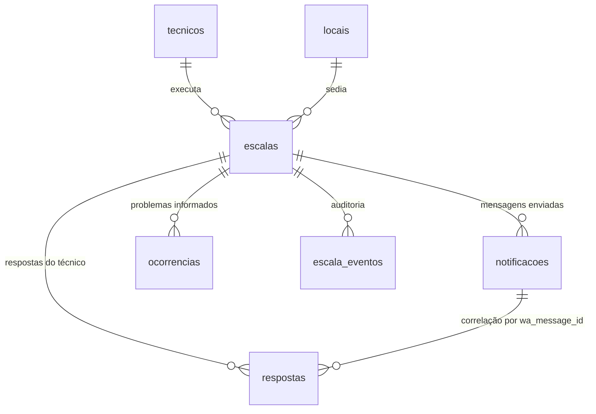

# Banco de dados

23 tabelas, 8 views, 110 funções (53 delas são a API `app_*`), 7 gatilhos e 1 agendamento.
Tudo versionado em `supabase/migrations` (01 a 49 — 6.592 linhas), e a produção está na 49 (28/09).
Os números vêm da leitura do código em [analise-codigo.md](analise-codigo.md); quando divergirem daqui, o código manda.

## Modelo


```mermaid
erDiagram
    tecnicos ||--o{ escalas : "executa"
    locais   ||--o{ escalas : "sedia"
    escalas  ||--o{ notificacoes : "mensagens enviadas"
    escalas  ||--o{ respostas : "respostas do técnico"
    escalas  ||--o{ ocorrencias : "problemas informados"
    escalas  ||--o{ escala_eventos : "auditoria"
    notificacoes ||--o{ respostas : "correlação por wa_message_id"
```

## Tabelas

| Tabela | Papel | Observações |
|---|---|---|
| `tecnicos` | Equipe de campo | `telefone_e164` único, só dígitos. `opt_in` controla envio; `is_supervisor` recebe alertas |
| `locais` | Obras e clientes | `link_maps` entra na mensagem do WhatsApp |
| `escalas` | Núcleo | Status, jornada calculada, auditoria. Índice único parcial: um técnico não tem duas escalas ativas no mesmo dia e hora — canceladas não contam |
| `notificacoes` | Uma linha por mensagem enviada | `wa_message_id` é a chave de correlação; `http_req_id` liga à resposta do pg_net |
| `respostas` | Cliques e mensagens do técnico | `wa_message_id` único garante idempotência do webhook |
| `ocorrencias` | Problemas informados | Motivo e detalhe enviados depois pelo técnico |
| `escala_eventos` | Trilha de auditoria | Quem mudou o quê e quando |
| `painel_usuarios` | Autorização | E-mail, papel (`admin`/`gestor`/`leitura`), ativo |
| `config` | Parâmetros operacionais | Muda comportamento sem deploy |
| `webhook_eventos` | Log bruto dos eventos da Evolution | A `apikey` é removida antes de gravar |
| `alertas_enviados` | Controle do alerta de prazo | Evita alerta duplicado no mesmo dia |
| `log_exclusoes` | Registro de exclusões definitivas | Não guarda nome nem telefone |
| `ligacoes` | Uma linha por ligação da URA | `call_sid` da Twilio, tecla digitada, duração e custo |
| `habilidades` | Catálogo do que o técnico sabe fazer | Não vence. NRs, CNH e ASO saíram daqui na migration 36 |
| `tipos_documento` | NR, CNH, ASO e outros documentos com validade | `palavras_chave` alimenta a classificação automática no envio em lote |
| `tecnico_documentos` | Validade de cada documento por técnico | Situação calculada em `vw_tecnico_documentos` |
| `tipo_atividade_documentos` | Documentos exigidos por tipo de atividade | Documento vencido reprova na aptidão |
| `tecnico_habilidades` | Quem sabe fazer o quê e em que nível | Sem validade: isso mora em `tecnico_documentos` |
| `tipos_atividade` | Tipos de serviço (CFTV, fibra, link...) | Ligado à escala por `escalas.tipo_atividade_id` |
| `tipo_atividade_requisitos` | Habilidades exigidas por tipo | Define quem é apto |
| `ligacoes` | Uma linha por ligação da URA | `call_sid` da Twilio, tecla digitada, duração e custo |
| `documentos` | Arquivos de NR, CNH e ASO | Sem as colunas `origem` e `url`: a migration 50 (decisão 42) removeu o vínculo por link. Todo documento vive no bucket privado |
| `empresas` | Empregadoras e clientes (CNPJ) | Base do Módulo Registro de Ponto (migration 53) |
| `backlog_itens` | Backlog do produto exibido na aba Roadmap | Grupos backlog, entrega e dívida; coluna do Kanban e posição |

### Status da escala

`rascunho` → `agendada` → `notificada` → `confirmada` | `recusada` → `em_execucao` → `concluida`.
`cancelada` e `reagendada` a qualquer momento. Só `agendada` e `notificada` entram no motor.

### Status do envio

`enfileirada` → `enviada` → `entregue` → `lida`, ou `falha`. O webhook nunca rebaixa o status.

## Views

| View | Para que serve |
|---|---|
| `vw_escalas_painel` | Tabela principal, com semáforo, jornada e `pode_remover` |
| `vw_acoes_pendentes` | O motor: o que fazer agora e com qual diagnóstico. Compara a hora local da escala com a hora local atual (migration 39) |
| `vw_resumo_dia` | Indicadores por dia |
| `vw_linha_do_tempo` | Auditoria + eventos do WhatsApp em ordem |
| `vw_ligacoes_pendentes` | Quem deve receber ligação agora: já recebeu WhatsApp N vezes, não respondeu, dentro da janela |
| `vw_documentos_expirados` | Documentos que passaram dos 5 anos após o desligamento do técnico |
| `vw_tecnico_habilidades` | Habilidades por técnico, com o nível |
| `vw_tecnico_documentos` | Documentos por técnico com situação: válido, vence em breve, vencido, sem data |

## Funções por família

**API do painel (`app_*`)** — únicas expostas ao navegador. Identificam o usuário por
`auth.jwt()`, conferem o papel e executam: `app_meu_acesso`, `app_escalas`, `app_resumo`,
`app_linha_do_tempo`, `app_tecnicos`, `app_locais`, `app_pendencias`, `app_config`,
`app_simular_jornada`, `app_criar_escalas`, `app_mudar_status`, `app_remover_escala`,
`app_reenviar_escala`, `app_salvar_tecnico`, `app_excluir_tecnico`, `app_salvar_local`,
`app_usuarios`, `app_salvar_usuario`, `app_habilidades`, `app_salvar_habilidade`,
`app_tecnico_habilidades`, `app_salvar_tecnico_habilidade`, `app_remover_tecnico_habilidade`,
`app_tipos_atividade`, `app_salvar_tipo_atividade`, `app_aptidao`, `app_painel_locais`,
`app_definir_habilidades`, `app_excluir_habilidade`, `app_habilidades_por_tecnico`,
`app_ligacoes`, `app_ligar_escala`, `app_documentos`, `app_registrar_documento`,
`app_excluir_documento`, `app_documentos_expirados`, `app_backlog`, `app_salvar_backlog_item`,
`app_mover_backlog_item`, `app_pode_gerir_documentos` (usada pelas políticas do bucket `documentos`).

> **Permissão por laço:** toda migration termina revogando `execute` de tudo no schema e
> concedendo de novo a **todas** as funções com prefixo `app_`. Lista manual já derrubou o painel
> uma vez (migration 26, corrigida na 27).

**Regra de negócio (`fn_*`)** — `fn_criar_escala`, `fn_criar_escalas_lote`, `fn_mudar_status`,
`fn_remover_escala`, `fn_excluir_tecnico`, `fn_salvar_usuario_painel`, `fn_exigir_papel`,
`fn_papel`, `fn_calcular_jornada`, `fn_pendencias_escala`.

**Mensageria** — `fn_dispatcher_whatsapp` (o motor, fases 1 a 6: confere respostas da Evolution, envia, aciona supervisores, alerta de prazo, documentos vencidos e ligações; desde a migration 41 uma falha numa escala fica registrada nela, com `erro_codigo = 'interno'`, sem travar as outras), `fn_payload_escala`, `fn_corpo_escala`,
`fn_titulo_escala`, `fn_msg_escala`, `fn_msg_supervisor`, `fn_evo_post`, `fn_evo_get`,
`fn_wa_texto`, `fn_avisar_supervisores`, `fn_alerta_prazo_escala`.

**Voz (URA)** — `fn_preparar_ligacao`, `fn_registrar_call_sid`, `fn_voz_twiml`, `fn_voz_resposta`,
`fn_voz_status`, `fn_disparar_ligacoes`, `fn_xml_escape`.

**Regras de escala** — `fn_validar_inicio` (nunca no passado), `fn_marcar_escala_teste`,
`fn_calcular_jornada`, `fn_aplicar_jornada`, `fn_aptidao`, `fn_nivel_valor`.

**Webhook** — `fn_webhook_evolution` (porta de entrada, confere o token), `fn_wh_status`
(entrega e leitura), `fn_wh_mensagem` (botões, 1/2, texto livre), `fn_tel_canonico`.

**Vigia do motor** — `fn_vigiar_motor` (agendada a cada 5 minutos em `setup/cron.sql`) lê
`motor_estado.ultima_execucao_ok`, gravada pelo motor ao fim de cada execução concluída, e avisa os
supervisores quando passam `motor_alerta_min` minutos sem execução (uma vez por ocorrência, dentro
da janela de envio) e quando normaliza. `app_estado_motor` alimenta o quadro da aba Operação
(migration 44).

**Infra** — `fn_config`, `fn_config_int`, `fn_segredo` (lê do Vault), `fn_fmt_duracao`,
`fn_http_resposta`, `fn_limpeza_logs` (retenção de logs, agendada em `setup/cron.sql`).

> **Hora da escala:** `data_servico` e `hora_inicio` são hora local, sem fuso. Nunca comparar
> `data_servico + hora_inicio` com `now()`, que é UTC no servidor. Comparar com
> `now() at time zone fn_config('fuso')`.

> **Pendência de limpeza:** `fn_teste_wa_texto`, `fn_teste_wa_botoes` e `fn_teste_wa_resposta`
> são da bancada de teste da migration 07 e podem ser removidas.

> **Backlog do Roadmap:** `backlog_itens.numero` é obrigatório, único e atribuído pelo gatilho
> `trg_backlog_numero` (`fn_numerar_backlog`), em sequência única para todos os grupos, desde a
> migration 43. Depois de atribuído, não muda. O painel exibe com três dígitos (001).

### Migrations 45 e 46 (27/09)

| Peça | O que faz |
|---|---|
| `fn_concluir_escalas()` | Fase 7 do motor: confirmada/em execução vira concluída 5 min depois do término previsto |
| `escalas_horario_ativo_unico` | Índice único parcial agora ignora `cancelada` e `recusada` (decisão 31) |
| `fn_pendencias_escala` | Técnico só com escala recusada conta como "sem escala" |
| `fn_dispatcher_whatsapp` | Trava `pg_try_advisory_xact_lock` (uma execução por vez), `lock_timeout` de 20 s, fase 7 e sinal ao monitor externo |
| `fn_evolution_falhando()` | Verdadeiro com 2+ falhas e nenhum envio com sucesso nos últimos 15 min; o sinal vai como `/fail` |
| `fn_avisar_tecnico(texto)` | WhatsApp para `alerta_tecnico_telefones` (sem repetir quem já é supervisor) |
| `fn_vigiar_motor` | Também avisa os telefones técnicos e, uma vez por dia na janela, o banco acima de `banco_alerta_mb` |
| `fn_limpeza_logs` | Também apaga `payload_envio` com mais de 90 dias |
| `fn_validar_config` / `trg_config_validar` | Validação dos parâmetros |
| Índices | `respostas(notificacao_id)`, `ocorrencias(escala_id)`, `ligacoes(tecnico_id)`, `escalas(local_id)`, `tecnico_documentos(documento_id)`; removido o duplicado `idx_notif_wa` |
| Removidas | `fn_teste_wa_botoes`, `fn_teste_wa_resposta`, `fn_teste_wa_texto` (bancada de teste) |

### Migration 47 (27/09): backlog 064 e 065

| Peça | O que faz |
|---|---|
| `fn_wh_mensagem` | Depois do "2", pede o motivo (1 Saúde, 2 Transporte, 3 Conflito de agenda, 4 Falta de material, 5 Outro) e grava em `ocorrencias.motivo`. Só pergunta se o técnico não tem outra escala aguardando resposta. Texto livre vira detalhe e, sem motivo, "outro" |
| `fn_motivo_rotulo(texto)` | Nome do motivo para mensagens e painel |
| `app_indicadores_resposta(dias)` | Recusas por motivo e mediana do tempo entre o primeiro envio e a resposta (aba Operação) |
| `app_escala_edicao(id)` / `app_editar_escala(p)` | Editar data, hora, local e tarefa. Mudou data, hora ou local de escala enviada: volta a aguardar resposta e reenvia. Só tarefa: avisa o técnico |
| `fn_edicao_permitida` (migration 48) | Intervalo mínimo de 2 minutos entre edições da mesma escala; escala de teste não avisa o técnico. Desde a migration 49 o motivo de saúde não existe (decisão 40) |
| `app_substituir_tecnico(escala, tecnico)` | Escala recusada gera outra igual para o técnico escolhido; eventos `substituida`/`substitui` ligam as duas |

### Migration 20260928235626 (28/09): trava de envio por ambiente (decisão 44)

`config.ambiente` (`producao` | `homologacao`) e `config.telefones_homologacao`. `fn_pode_enviar(telefone)`
libera tudo em produção; em homologação, só técnico com `perfil_teste` ou número liberado.
`fn_evo_post` (toda saída de WhatsApp) e `fn_preparar_ligacao` (URA) consultam a trava; `app_config`
devolve `ambiente`.

### Migration 51 (29/09): Administração do Sistema > Checklist

| Objeto | O que faz |
|---|---|
| `saude_testes` | Registro das consultas ao vivo (`alvo` = `evolution` ou `status_*`, `req_id` do pg_net, erro, quem testou em `criado_por` = e-mail do admin). RLS ligado, sem políticas. Guarda as 100 linhas mais recentes (20 testes). |
| `app_checklist_testar()` | Só admin. Enfileira pelo pg_net o `connectionState` da Evolution e as quatro páginas públicas de status (Supabase, Twilio, GitHub, Vercel). Dentro de 10 s do último teste, não repete (`recente: true`). |
| `app_checklist_saude()` | Só admin. Devolve itens `{grupo, item, estado ok/atencao/falha/info, detalhe}`: banco (tamanho, última migration), motor, cron, pg_net, configuração e conexão da Evolution, webhook, envios, escalas vencidas sem envio, notificações e webhook com erro, credenciais e ligações da Twilio. Só contagens, datas e nomes de segredos (nunca valores); da resposta da Evolution sai só o código HTTP e o `state`. |

Todas as consultas externas saem do banco: o navegador do admin só fala com o Supabase. Das páginas de
status lê-se só `status.indicator` e `status.description`. O painel acrescenta, sem rede, a versão
publicada e o link do GitHub Actions.

### Migration 52 (30/09): índices das chaves estrangeiras

Cinco índices pedidos pelo linter do Supabase (`unindexed_foreign_keys`): `documentos`,
`tecnico_documentos` e `tipo_atividade_documentos` em `tipo_documento_id`; `tecnico_habilidades` e
`tipo_atividade_requisitos` em `habilidade_id`. Só estrutura.

### Migration 53 (06/10): Módulo Registro de Ponto — cadastros-base (backlog 080, decisão 48)

- **`empresas`** (nova, RLS sem políticas): CNPJ único com dígito verificador (`fn_cnpj_valido`),
  razão social, cidade/UF, fuso (`America/Bahia`), `empregadora` (o ponto dos funcionários sai no
  CNPJ dela). Funções `app_empresas` (todos os papéis) e `app_salvar_empresa` (admin, gestor).
- **`tecnicos`**: `cpf` (dígito verificador por `fn_cpf_valido`, único), `matricula` (única por
  empresa), `admissao`, `empresa_id`. **Minimização (revisão do `seguranca`):** a lista de
  `app_tecnicos` nunca traz o CPF inteiro — admin e gestor recebem `***.982.247-**` (padrão gov.br,
  sem os dígitos verificadores), leitura recebe nulo; o CPF inteiro só sai por `app_tecnico_cpf`
  (admin, gestor), chamada ao abrir a ficha. `app_salvar_tecnico` ignora CPF mascarado e só altera um
  campo novo quando ele vem no pedido. Corrige a data de desligamento, que a tela mandava e a função
  ignorava. `app_salvar_local` passa a recusar link do Maps que não comece com `http(s)://`.
- **`locais`**: `latitude`, `longitude` (as duas ou nenhuma), `raio_m` (20 a 5.000, padrão 200) e
  `cliente_empresa_id`. A área é usada no ponto para sinalizar marcação fora do local.
- Índices nas três chaves estrangeiras novas.

### Migration 54 (06/10): Módulo Registro de Ponto — marcações (backlog 081, decisão 48)

- **`ponto_marcacoes`** (RLS sem políticas): **só inclusão** — gatilhos recusam update, delete e
  truncate (`fn_ponto_imutavel`). NSR sequencial por empresa sem lacuna (a linha de `ponto_nsr` fica
  travada na transação), hora do servidor (`momento`), CPF do momento, tipo (entrada, saída e volta
  do almoço, saída, início e fim de hora extra), canal (app, WhatsApp, URA), localização obrigatória
  fora da URA, local de referência (o da escala de hoje; sem escala, o local com área mais perto),
  distância e `dentro_area` (tolerância: precisão do aparelho, até 100 m). Fora da área é sinalizado,
  nunca bloqueado. **Hash encadeado** (`fn_ponto_hash`, SHA-256 de todos os campos + hash anterior).
- **Porta única garantida pelo banco** (revisão do `seguranca`): gatilho `before insert` recusa
  marcação que não continue a cadeia (NSR seguinte, hash anterior, hash conferido, hora de agora);
  `ponto_nsr` só avança de um em um; `anon`, `authenticated` e **`service_role`** sem nenhum acesso
  direto às três tabelas. `origem` guarda só `msg_id`, `call_sid` e `app_versao` (até 2 KB) — nunca
  o conteúdo da mensagem, porque a tabela não admite descarte antes do prazo.
- **`ponto_ajustes`**: incluir ou desconsiderar, com motivo (mínimo 10 caracteres) e autor; também só
  inclusão. A marcação original nunca muda.
- **`fn_ponto_registrar`** (interna, sem acesso pelo painel): a porta única dos canais; devolve o
  comprovante (NSR, empresa, CNPJ, nome, CPF, data, hora no fuso da empresa, tipo, local, código de
  autenticação).
- **`app_ponto_marcacoes`** (todos os papéis; leitura sem coordenadas, até 62 dias) e
  **`app_ponto_verificar`** (admin: recalcula a cadeia e aponta lacuna ou hash adulterado).
- Gatilho em `tecnicos`: técnico com marcação **não pode ser excluído** (guarda de 5 anos).
- Nenhuma rotina de limpeza toca nestas tabelas. Descarte depois de 5 anos só por migration própria,
  que desliga o gatilho de forma registrada.

### Migration 55 (07/10): Módulo Registro de Ponto — login do funcionário (backlog 082, decisão 49)

- **`ponto_codigos`** (código de 6 dígitos só como hash; origem WhatsApp ou gestor; tentativas),
  **`ponto_sessoes`** (hash do token, 12 h, sessão única, `login_origem`), **`ponto_ciencias`**
  (ciência do aviso de privacidade por versão) e **`ponto_acessos`** (pedidos e tentativas, com IP — `cf-connecting-ip` ou o último
  endereço do `x-forwarded-for`, nunca o primeiro, que quem chama controla: base dos limites). RLS sem políticas; nenhum papel com acesso direto. Guarda (LGPD, em
  `fn_limpeza_logs`): códigos 24 h, sessões 90 dias, acessos 30 dias.
- Limites contra força bruta e disparo em massa: ver decisão 49. Com teto total estourado, só o
  código do gestor entra, e os supervisores recebem aviso pelo WhatsApp (uma vez por hora,
  `fn_ponto_alerta_teto`). O gestor que gerou o código fica na sessão e na marcação (`origem.gestor`, e-mail do gestor:
  dado pessoal guardado 5 anos dentro do hash, com base legal na apuração de fraude no ponto). Erro de
  login gasta só as tentativas do código de WhatsApp; o código do gestor passa por cima do bloqueio
  por funcionário e continua sob os limites por IP e total. Parâmetros novos em `config`:
  `ponto_max_codigos_hora` (60) e `ponto_max_erros_hora` (300).
- API do funcionário (`anon`): `ponto_pedir_codigo`, `ponto_entrar`, `ponto_sair`, `ponto_eu`,
  `ponto_registrar_ciencia`, `ponto_bater` (chama `fn_ponto_registrar` com o funcionário da sessão) e
  `ponto_minhas_marcacoes`. Contingência no painel: `app_ponto_gerar_codigo` (admin, gestor; 15 min).

### Migration 58 (08/10): bairro e cidade das marcações (decisão 50)

- **`ponto_geo`**: bairro, cidade e UF por coordenada arredondada em 3 casas (~110 m), vindos do
  Nominatim/OpenStreetMap. RLS sem políticas. A marcação não muda.
- **`fn_ponto_geo_processar`** (pg_cron a cada minuto, só na produção): lê as respostas, enfileira as
  coordenadas novas e envia uma consulta por execução. Parâmetro `geocodificacao_url` (vazio desliga).
- **`app_ponto_geo(de, até, técnico)`**: bairro e cidade de cada marcação do período, para o painel.

### Migration 57 (08/10): escala exige local

- Gatilho **`trg_escalas_exige_local`** (`fn_escala_exige_local`): inserir escala sem local, ou
  apagar o local de uma escala, é recusado — em qualquer caminho (painel, importação, lote, edição).
- **`fn_payload_escala`** recusa montar a mensagem de escala sem local: escala antiga sem local não é
  enviada; o motor registra a falha e, esgotadas as tentativas, avisa o supervisor.
- URA: **`fn_preparar_ligacao`** (motor e botão de ligar) recusa escala sem local, e
  **`vw_ligacoes_pendentes`** não a lista. **`fn_evolution_falhando`** ignora falha interna
  (`erro_codigo = 'interno'`), para escala sem local não virar alarme falso de Evolution caída.
- Como `escalas.local_id` é `on delete set null`, apagar um local com escalas agora é recusado pelo
  gatilho (o painel só desativa local, não apaga).

### Migration 56 (07/10): Módulo Registro de Ponto — WhatsApp e acompanhamento do gestor (backlog 083 e 090)

- **WhatsApp:** `fn_webhook_evolution` passa cada mensagem primeiro por **`fn_ponto_wh`**, que devolve
  null quando não é do ponto (aí segue para `fn_wh_mensagem`, sem mudança). Só conversa com o ponto
  quem tem CPF e empresa. Palavras: ponto (menu de 1 a 6 com sugestão), entrada, almoço (saída ou
  volta, conforme a última), volta, saída, HE (início ou fim). Depois pede a **localização atual**; a
  hora é a do recebimento. Lugar escolhido no mapa (com nome ou endereço) é recusado. Comprovante com
  CPF mascarado. **`ponto_conversas`** guarda só a etapa (10 minutos), sem conteúdo de mensagem.
  Índice único em `origem->>'msg_id'`: entrega repetida da Evolution não duplica marcação.
  Recusa também localização encaminhada; ignora grupo, status, canal, mensagem sem id e telefone
  canônico que case com mais de um funcionário; número citando outra mensagem (a escala) não vale
  como escolha do menu; ao funcionário só volta mensagem de regra (`P0001`). Falha no ponto nunca
  derruba o fluxo de escalas. **LGPD:** `webhook_eventos` não guarda a localização (fica só
  `{"localizacao": true}`); a coordenada mora na marcação.
- **`fn_ponto_wa`**: envio do ponto pelo WhatsApp que nunca desfaz a marcação se o envio falhar.
- **`fn_ponto_lembrete_almoco`**: lembrete amigável da saída para o almoço, uma vez por dia, a quem só
  marcou entrada, entre `ponto_lembrete_almoco` (config, 12:00) e 15h; deduplicado em
  `alertas_enviados`. Agendado só na produção (`supabase/setup/cron.sql`). Retorno do almoço sem lembrete.
- **Painel:** `app_ponto_hoje` (por funcionário com ponto: escala do dia, última marcação, fora da
  área, situação `sem_entrada`/`com_marcacao`/`sem_marcacao`) e `app_ponto_acompanhamento(de, até,
  técnico)` (até 62 dias; para `leitura` some o e-mail do gestor e as coordenadas).

## Gatilhos em `escalas`

| Gatilho | O que faz |
|---|---|
| `trg_escalas_jornada` | Calcula turno, término, intervalo e minutos noturnos |
| `trg_escalas_confirmacao` | Carimba `confirmada_em` |
| `trg_escalas_updated` | Atualiza `updated_at` |
| `trg_escalas_evento` | Grava a auditoria em `escala_eventos` |
| `trg_escalas_teste` | Marca como teste a escala de técnico com perfil de homologação |

## Parâmetros (`config`)

Envio: `intervalo_reenvio_min` (30), `max_tentativas` (3), `timeout_entrega_min` (10),
`avisar_supervisor_na` (2), `envios_por_execucao` (3), `janela_envio_inicio` (06:00),
`janela_envio_fim` (21:00), `usar_botoes` (true), `webhook_ativo` (true).

Jornada: `jornada_min` (480), `intervalo_min` (60), `intervalo_apos_min` (240),
`noturno_inicio` (22:00), `noturno_fim` (05:00), `hora_noturna_min` (52.5).

Habilidades: `certificacao_aviso_dias` (30), `alerta_certificacoes_hora` (08:00),
`alerta_certificacoes_dow` (1 = segunda; 0 desliga o alerta).

Prazo: `alerta_escala_aviso` (16:00), `alerta_escala_prazo` (18:00),
`alerta_dias_semana` (1,2,3,4,5), `sem_escala_incluir_supervisores` (false).

Voz (URA): `ligacao_ativa` (false), `ligacao_apos_tentativas` (2), `ligacao_janela_inicio`/`_fim`
(08:00/20:00), `ligacao_max_por_escala` (2), `ligacao_intervalo_min` (45), `ligacao_por_execucao` (2),
`twilio_caller_id`, `voz_url`, `voz_voice`, `voz_timeout_dtmf`. Ver `supabase/setup/twilio.md`.

Voz (URA): ver `supabase/setup/twilio.md`. Documentos: ver `supabase/setup/documentos.md`.

Escala: `antecedencia_minima_min` (5) — minutos mínimos entre agora e o início da escala;
`conclusao_automatica_min` (5) — minutos depois do término previsto para a escala confirmada ou em
execução virar concluída (fase 7 do motor, decisão 30).

Retenção: `retencao_webhook_dias` (30), `retencao_cron_dias` (7), `retencao_payload_dias` (90,
apaga só o conteúdo enviado de `notificacoes.payload_envio`; a notificação fica).

Vigia: `motor_alerta_min` (5) — minutos sem execução concluída do motor para avisar os supervisores;
`alerta_tecnico_telefones` — telefones que também recebem os avisos técnicos (motor parado,
normalizado, banco cheio); `banco_alerta_mb` (350) — tamanho do banco que gera um aviso por dia;
`monitor_ping_url` — URL do healthchecks.io que recebe o sinal do motor (vazio desliga; decisão 34).

**Validação (migration 45):** o gatilho `trg_config_validar` recusa valor fora do formato das chaves
conhecidas (inteiro, hora `HH:MM`, `true`/`false`, fuso existente, lista de dias 1–7, telefones
E.164). Chave nova sem regra é aceita como texto.

Ambiente: `evolution_url`, `evolution_instancia`, `evolution_versao`, `webhook_url`, `fuso`.

Mudar qualquer um é um `update` — sem deploy:

```sql
update config set valor = '20' where chave = 'intervalo_reenvio_min';
```
