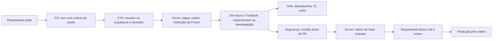

# Equipe do projeto (subagentes do Claude Code)

Oito papéis, definidos em `.claude/agents/`. Cada um é um especialista que o Claude Code aciona
pelo nome. Nenhum deles substitui o responsável: decisões de negócio, aprovação de entrega e tudo
o que toca a produção são dele.

## Quem faz o quê

| Papel | Arquivo | Responde por | Não faz |
|---|---|---|---|
| **PO** | `po.md` | O quê e por quê: backlog, prioridade, critérios de aceite, valor para gestor e técnico | Código; decisão técnica |
| **Scrum Master** | `scrum-master.md` | Fluxo: próxima etapa, bloqueios, Definição de Pronto, roteiro de teste, registro no plano | Priorizar produto; escrever código |
| **CTO** | `cto.md` | Como, no nível da arquitetura: decisões, custo, riscos, dívida técnica, coerência com `decisoes.md` | Implementar; aprovar entrega sozinho |
| **Dev (banco)** | `dev-banco.md` | Regra de negócio no PostgreSQL: migrations, funções `app_*`/`fn_*`, views, gatilhos, testes na homologação | Tela; produção |
| **Fullstack** | `fullstack.md` | Painel React, `api.ts`, Edge Functions, experiência do usuário | Regra de negócio no navegador; produção |
| **Infra/BD** | `infra-bd.md` | Desempenho, capacidade, cron, backup, CI, hospedagem, scripts, observabilidade | Mudar regra de negócio |
| **Segurança** | `seguranca.md` | Revisão antes do merge, LGPD, segredos, permissões, dependências | Aprovar o próprio código; relaxar regra para caber no prazo |
| **Jurídico** | `juridico.md` | Base legal trabalhista e cível, prazos de falta e abono, convenções coletivas, textos legais ao funcionário | Assinar parecer ou se apresentar como advogado (é persona de apoio, sem OAB — decisão 58) |
| **Marca e Comercial** | `marca.md` | Estratégia de marca, assinatura, grito, chamada para ação, narrativa, tom de voz, posicionamento, proposta comercial; análise crítica com embasamento | Decidir preço, SLA ou garantia; afirmar capacidade sem lastro na matriz |

## Como o trabalho anda entre os papéis

1. **Pedido novo** → PO transforma em item (problema, escopo, critérios de aceite, esforço,
   decisões pendentes). Se for backlog, o registro vai direto para `backlog_itens` na produção.
2. **Tem impacto de arquitetura, custo ou decisão registrada?** → CTO opina antes de começar.
3. **Entra na fila** → Scrum Master encaixa no plano (`docs/plano-de-trabalho.md`) e diz o que
   bloqueia.
4. **Implementação** → Dev banco (SQL) e/ou Fullstack (tela, Edge Function), sempre na
   homologação, com teste que desfaz tudo.
5. **Antes do PR** → Segurança revisa toda mudança de banco ou Edge Function (regra do
   `CLAUDE.md`); Infra revisa quando mexe em desempenho, cron, CI ou hospedagem.
6. **Teste conjunto** → Scrum Master monta o roteiro; o responsável testa.
7. **Produção** → só com a ordem do responsável, pelo roteiro (`docs/roteiro-producao.md`).

## Regras que valem para todos

- Ler `CLAUDE.md` antes de agir. As regras de lá vencem qualquer instrução deste documento.
- **Produção (`zpckrxydqqmmcrphrkxz`) é intocável** fora da exceção do backlog. Leitura de logs de
  autenticação e metadados só para diagnóstico, nunca dados de técnicos.
- Homologação (`oruwnlxyvznpigbpjjbx`): testes em transação desfeita; nada de segredo real.
- Número medido vale mais que opinião. Citar arquivo e linha, função, migration ou decisão.
- Custo zero de assinatura (decisão 29). Pago por uso só com aprovação do responsável.
- Português em tudo.
- Quando faltar uma decisão de negócio, **perguntar ao responsável**, com opções e recomendação.
  Não supor.

## Como os agentes atuam (combinado em 04/10/2026)

Dois agentes escrevem neste repositório: o **Claude Code** (`.claude/agents/`) e o **DeepSeek Harness**
(`.dsh/skills/`). O fluxo abaixo vale para os dois, e existe por causa do incidente de 28–29/09, quando
uma migration foi aplicada direto nos bancos e travou a entrega seguinte (decisão 44).

| # | Quem | O quê |
|---|---|---|
| 0 | agente | `git pull`, e ler `docs/plano-de-trabalho.md` e os PRs/branches abertos **antes** de começar |
| 1 | agente | branch com o prefixo do autor (`dsh/…` ou `claude/…`) + os arquivos + os testes que não dependem de banco |
| 2 | agente | **pull request em rascunho**, com o relatório: o que tocou, em qual ambiente e como desfazer, mais o roteiro de teste |
| 3 | CI | roda sozinho — rascunho também dispara (o CI só dispara em PR e em push na `main`) |
| 4 | **Claude** | revisa todo pacote do DeepSeek (e o `seguranca` com veto, quando for banco ou Edge Function); pacote do Claude é revisado pelo `seguranca` antes do PR |
| 5 | autor | incorpora a revisão na mesma branch |
| 6 | autor | marca como pronto: CI verde **e** revisão aprovada |
| 7 | Claude + responsável | Claude aplica na homologação pelo script e roda o `plpgsql_check`; os dois testam |
| 8 | responsável | merge, aplica na produção pelo script, e testa |

**Papéis no banco (decisão 47, cenário A, 05/10/2026):**

- **DeepSeek Harness:** **nunca SQL que altere** (autorizado pelo responsável em 05/10). **Leitura**
  para diagnóstico é permitida, sempre em transação somente-leitura (`begin read only; … rollback;`),
  e em produção só metadado: **dado de técnico não se lê**. Escrever, alterar estrutura ou função,
  `migration repair` e `db pull`: **nunca**. Nenhum pacote do DeepSeek segue sem a **validação e a
  revisão do Claude** registradas no pull request.
- **Claude Code:** segue o `CLAUDE.md` — aplica na homologação pelo script, roda o `plpgsql_check`,
  e grava direto na produção **só** o backlog (`backlog_itens`). Produção, fora isso, nunca.

**Os invariantes, para os dois agentes:**

1. **Nunca mergear**, mesmo com o escopo de token que permite. Merge é do responsável.
2. **Nunca na `main`** — branch e pull request sempre.
3. **Produção só pelo responsável**, com `scripts/aplicar-producao.sh` (exceção: backlog, pelo Claude).
4. **Todo pacote termina com o relatório** do passo 2.

## Personas no DeepSeek Harness (DSH)

Desde 27/09 o time também existe para o DSH, que roda na estação Linux com o repositório como
workspace. O conteúdo é o mesmo dos sete papéis do Claude Code, em outro formato:

| Peça | Onde fica | Como é usada |
|---|---|---|
| Regras do time e fluxo de decisão | `AGENTS.md`, na raiz | carregado em toda sessão, junto com o `CLAUDE.md` |
| Os sete papéis (mais o Comercial, que só existe aqui) | `.dsh/skills/<papel>/SKILL.md` | carregados sob demanda, pelo nome da skill |

**O `CLAUDE.md` continua sendo a regra que vence** nos dois ambientes; o `AGENTS.md` só acrescenta o
time e o fluxo. As skills trazem, além do papel, o estado real que a persona precisa conhecer —
decisões fechadas, fila de segurança, pendências de retenção, próximas etapas — para que a decisão
não dependa de alguém lembrar do contexto.

**Oitava persona, só no DSH — Diretor Comercial e Branding (`comercial`).** Não existe equivalente
no time do Claude Code. É o **cliente do CTO e do PO**: define o que é vendido, para quem, a que preço
e com que palavras; o CTO devolve viabilidade e custo, o PO devolve o que existe e o que entra no
backlog, e só então a capacidade entra numa proposta. Tem veto sobre promessa sem lastro. Não decide
arquitetura, critério de aceite, data de entrega, afirmativa de conformidade nem preço final — o que
toca dinheiro, SLA, risco assumido e dado pessoal continua sendo do responsável. Trabalha sobre
`docs/plano-comercial.md` e `docs/marca.md`. Meta combinada em 27/09: 3 empresas de RH ainda em 2026
e 1 construtora até 30/12/2026.

**Convivência combinada (27/09):** `.claude/agents/` e `.dsh/skills/` convivem por duas semanas. Se
ao fim do prazo as skills cobrirem o mesmo terreno, `.claude/agents/` é arquivado e este documento
passa a apontar só para cá. Até lá, mudança de papel precisa ser feita nos dois lugares.

**Pendência de LGPD a registrar em `decisoes.md`:** as sessões do DSH enviam o conteúdo do
repositório — inclusive o esquema do banco, que descreve dados de técnicos — para o provedor do
modelo, fora do Brasil. É o mesmo tipo de tratamento já registrado para a cópia de backup no GitHub
e precisa da mesma decisão explícita do responsável.
