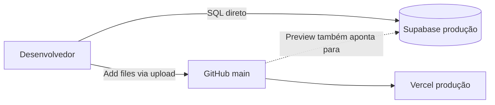
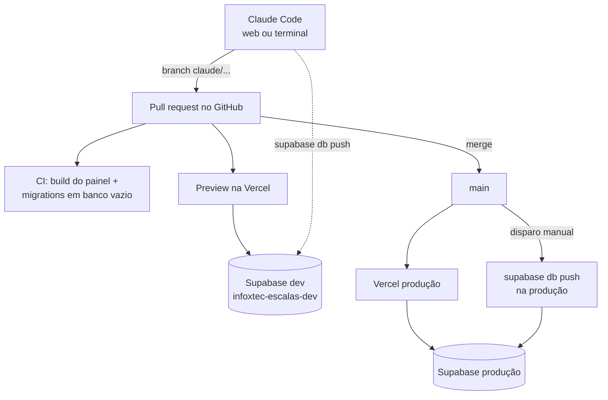

# Fluxo de desenvolvimento e topologia

Como uma mudança sai da ideia e chega à produção, qual ambiente usar para quê, e o que muda (e o
que não muda) na infraestrutura atual.

## Resposta curta

1. **O ambiente de homologação era necessário.** É o item 2 do Bloco 1 de
   [segurança e homologação](seguranca-homologacao.md): sem ele, toda mudança é testada em
   produção, com mensagens reais indo para técnicos reais. O projeto Supabase
   `infoxtec-escalas-dev` criado em 26/09 é a peça que tem valor permanente.
2. **A máquina Linux no Mac não é o centro do fluxo.** Ela é útil para rodar o painel localmente,
   mas não é obrigatória. O centro é o **GitHub**: toda mudança entra por branch e pull request,
   escrita pelo Claude Code, conferida por CI e testada contra o banco de homologação.
3. **A produção não precisa trocar de infraestrutura.** Supabase, Vercel, Evolution e Twilio
   continuam. O que muda é o **caminho** por onde as mudanças chegam lá. Há três ajustes de
   infraestrutura que valem a pena por outros motivos (plano da Vercel, backup do Supabase e
   desligar o Retool), descritos em [Deve migrar a produção?](#deve-migrar-a-produção).

## Como é hoje



| Problema | Consequência |
|---|---|
| Migrations aplicadas direto na produção e copiadas para o repositório depois | O repositório é espelho, não fonte. Erro vai direto para técnicos reais (decisão 24) |
| Commits por upload na interface web do GitHub | 18 de 21 commits são "Add files via upload": sem histórico útil, sem revisão |
| Sem CI | Nada confere se o painel compila ou se as migrations rodam do zero antes de publicar |
| Preview da Vercel usa as variáveis da produção ([deploy-vercel.md](deploy-vercel.md), passo 3) | Um deploy de teste lê e grava no banco real |

## Topologia recomendada



### Os três ambientes

| | Local | Homologação | Produção |
|---|---|---|---|
| Banco | Supabase dev | Supabase dev | Supabase `zpckrxydqqmmcrphrkxz` |
| Painel | `npm run dev` na máquina Linux | Preview da Vercel de cada PR | https://infoxtec-escalas.vercel.app |
| WhatsApp e ligações reais | Não | Não | Sim |
| Quem aplica migration | Você ou o Claude Code, com `db push` | Idem | Só depois do merge, por disparo manual |
| Dados | Fictícios (`supabase/seed.sql`) | Fictícios | Reais (LGPD) |

**O banco dev nunca recebe os segredos da Evolution e da Twilio, nem o `setup/cron.sql`.** É isso
que garante que nenhum teste dispara mensagem ou ligação real.

## Onde o Claude Code entra

| Modo | O que precisa no Mac | Quando usar |
|---|---|---|
| **Claude Code na web** (claude.ai/code) | Só o navegador | **Padrão.** Roda num Linux na nuvem, clona o repositório, compila, faz commit numa branch e abre PR |
| Claude Code no terminal, na máquina Linux | A máquina Linux ([ambiente-dev-mac.md](ambiente-dev-mac.md)) | Quando for preciso rodar o painel localmente, depurar ou aplicar migration no dev junto com a mudança |
| Claude Code no terminal do macOS | Node no macOS | Evitar neste Mac: sem Homebrew, a instalação de ferramentas fica manual |

Para um MacBook Air Intel de dois núcleos, a web é o melhor custo-benefício: o trabalho pesado
(instalar dependências, compilar, rodar migrations em banco vazio) acontece fora do Mac.

As regras que o Claude Code deve seguir neste repositório estão no [`CLAUDE.md`](../CLAUDE.md), na
raiz. Ele é lido automaticamente em toda sessão.

## O ciclo de uma mudança

> A versão prática deste ciclo, com os scripts e a lista de etapas pendentes, está em
> [plano-de-trabalho.md](plano-de-trabalho.md).

1. **Pedir.** No Claude Code, descrever a mudança. Ele cria a branch, escreve a migration nova
   (`npx supabase migration new 39_descricao`), altera o painel e confere o build.
2. **Revisar.** O Claude Code abre o PR. O CI roda e a Vercel publica um preview.
3. **Aplicar no dev.** Na máquina Linux, com o projeto dev ligado: `npx supabase db push`.
   Na fase 3 do roteiro isso passa a ser automático.
4. **Testar.** Abrir o preview da Vercel (que aponta para o dev) e conferir a tela.
5. **Juntar.** Merge do PR em `main`. A Vercel publica o painel em produção.
6. **Aplicar na produção.** Rodar a migration na produção. A ordem importa:
   - Mudança de estrutura (tabela, coluna, função nova) **antes** do painel que a usa.
   - Dado novo que a tela precisa saber exibir **depois** do painel publicado (decisão 24).
7. **Conferir.** O carimbo de versão no topo do painel diz qual build está no ar.

## Deve migrar a produção?

Não como um projeto de migração. Os componentes ficam; alguns ajustes valem a pena.

| Componente | Decisão | Motivo |
|---|---|---|
| Supabase produção | **Manter** o projeto. Avaliar o plano Pro | O plano Free não inclui backup diário com restauração pelo painel, e o Bloco 1 exige backup testado. Confira preço e limites em supabase.com/pricing |
| Vercel Hobby | **Trocar o plano**: Vercel Pro ou Cloudflare Pages | Hobby é restrito a uso não comercial (decisão 6). A troca de plano não muda o fluxo; a do Cloudflare exige refazer as variáveis e o domínio |
| Evolution API | Manter por ora | A migração para a API oficial da Meta já é o item 1 do Bloco 1 e não depende deste fluxo |
| Twilio | Manter | Sem problema identificado |
| Retool | **Desligar** | Quem tem edição lá executa SQL na produção sem passar por nada disto |
| Edge Functions | Manter | Passam a ser publicadas a partir de `main`, não da máquina de alguém |

### Conferir se a produção bate com o repositório

Antes de adotar o fluxo, uma vez só. Na máquina Linux:

```bash
npx supabase link --project-ref zpckrxydqqmmcrphrkxz
npx supabase migration list          # colunas Local e Remote devem ser idênticas
npx supabase link --project-ref <ref-do-dev>   # voltar para o dev logo em seguida
```

Se alguma versão aparecer só em um dos lados, alguém mudou o banco de produção sem migration.
Isso precisa ser resolvido antes, porque o fluxo parte do princípio de que o repositório é a fonte.

## Roteiro

| Fase | O quê | Esforço | Situação |
|---|---|---|---|
| 0 | Projeto Supabase dev com as 38 migrations e dados fictícios; máquina Linux no Mac | 1 dia | **Feito** (26/09) |
| 1 | Higiene do repositório | 1 dia | Parcial |
| 2 | CI no GitHub Actions | 1 a 2 dias | A fazer |
| 3 | Migrations no dev automáticas; produção por disparo manual | 1 dia | A fazer |
| 4 | Ajustes de infraestrutura da produção | Depende de contratação | A decidir |
| 5 | Testes das regras críticas e correções de segurança | 1 a 2 semanas | A fazer |

### Fase 1 — Higiene do repositório

- [x] `.gitignore` (`node_modules`, `dist`, `.env.local`, `supabase/.temp`)
- [x] `CLAUDE.md` com as regras do projeto
- [ ] Parar de subir arquivos pela interface web do GitHub. Toda mudança entra por branch e PR
- [ ] Conferir produção contra o repositório (seção acima)
- [ ] Vercel → **Settings → Environment Variables**: deixar as variáveis atuais só em
      **Production** e criar as de **Preview** com a URL e a chave do projeto dev
- [ ] Supabase dev → **Authentication → URL Configuration**: incluir `http://localhost:5173/**` e
      `https://*.vercel.app/**` nas Redirect URLs, e desligar o cadastro público como na produção
- [ ] Proteger a branch `main` no GitHub (**Settings → Branches**), se o plano da organização
      permitir em repositório privado. Se não permitir, a regra fica combinada: nada vai direto
      para `main`

### Fase 2 — CI

Um workflow em `.github/workflows/` que, em todo PR:

1. Roda `npm ci && npm run build` em `web/`, o que inclui a checagem de tipos.
2. Sobe um Postgres do Supabase no próprio GitHub Actions e reaplica as migrations do zero
   (`supabase db start`). É a mesma verificação que o Supabase faz ao conferir o repositório, só
   que antes do merge.

Não precisa de nenhum segredo, porque não toca em nenhum projeto real.

### Fase 3 — Migrations automatizadas

- Em PR: `supabase db push` no projeto dev, com os segredos `SUPABASE_ACCESS_TOKEN`,
  `SUPABASE_DB_PASSWORD` e a ref do dev cadastrados no GitHub.
- Em produção: workflow disparado à mão (`workflow_dispatch`) depois do merge, respeitando a ordem
  do passo 6 do ciclo. Nunca automático.

### Fase 4 — Infraestrutura da produção

Decisões de contratação, não de código: plano da Vercel ou mudança para Cloudflare Pages, plano Pro
do Supabase e data para desligar o Retool.

### Fase 5 — Qualidade e segurança

- Testes pgTAP para `fn_calcular_jornada`, `vw_acoes_pendentes` e `fn_webhook_evolution`,
  rodando no CI da fase 2.
- `documento-ocr`: validar a assinatura do JWT dentro da função, sem depender só do `verify_jwt`.
- `voz-escala`: validar a assinatura `X-Twilio-Signature` em vez de depender só do token na URL.
- Trocar o `xlsx` 0.18.5, que tem vulnerabilidade alta sem correção no npm.

Esses itens estão detalhados na análise do repositório e no Bloco 3 de
[segurança e homologação](seguranca-homologacao.md).

## Observação sobre o projeto dev

Projetos no plano Free do Supabase são pausados depois de um período sem uso. Se o painel local ou
o preview pararem de conectar depois de alguns dias parados, abra o projeto dev no Supabase e
clique em **Restore project**.
