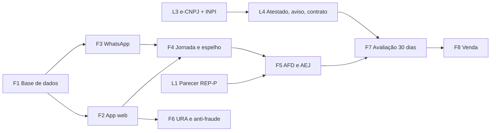

# Plano do Módulo Registro de Ponto

Aprovado pelo responsável em 06/10/2026. Cada tarefa tem número no backlog (aba Roadmap). A
legalização (L) corre em paralelo ao desenvolvimento (F). Ciclo de sempre: branch → pull request →
Claude aplica na homologação → testamos juntos → responsável aplica na produção.

## Visão das fases

## Legalização (em paralelo)

| Backlog | Tarefa | Quem | Aceite |
|---|---|---|---|
| **076** | L1 · Parecer jurídico REP-P | Gabriel Pirolli | parecer escrito respondendo às perguntas de [legal.md §2](legal.md) |
| **077** | L2 · Convenção coletiva, folha e eSocial | Andreia Monteiro | tolerâncias, HE, banco de horas e intervalos da categoria; formato do espelho para a folha |
| **078** | L3 · Certificado e-CNPJ e registro no INPI | responsável (Claude prepara) | certificado de registro do programa emitido |
| **079** | L4 · Atestado técnico, aviso de privacidade, termo de uso, contrato com anexo LGPD | Claude redige, Gabriel revisa | quatro documentos revisados e assinados |

## Desenvolvimento

### F1 · Base de dados — backlog **080** e **081**
- `empresas`: CNPJ, razão social, endereço, fuso, parâmetros de jornada por empresa.
- Funcionário (`tecnicos`): **CPF**, matrícula, data de admissão, empresa.
- `locais`: latitude, longitude e **raio** da área aceita; vínculo com a empresa cliente.
- `ponto_marcacoes` **só de inclusão** (gatilho que recusa update e delete): NSR sequencial por
  empresa, hora do servidor, tipo (entrada, saída para almoço, volta, saída, início e fim de HE),
  canal (app, whatsapp, ura), latitude, longitude, precisão, dentro/fora da área, hash encadeado.
- `ponto_ajustes`: correção separada, com motivo, autor e data; a marcação original nunca muda.
- Guarda de 5 anos; as rotinas de limpeza ficam proibidas de tocar nessas tabelas.
- **Aceite:** update e delete recusados pelo banco; NSR sem lacuna; `plpgsql_check` zero.

### F2 · App web do funcionário — backlog **082**
- Página "Bater ponto" separada do painel, instalável no celular.
- Login do funcionário com **sessão única** (novo login derruba a anterior); sem acesso a dados de
  outros.
- Aviso de privacidade no primeiro acesso, com registro do ciente.
- GPS do navegador obrigatório; botões Entrada / Almoço / Volta / Saída / Hora extra.
- Comprovante na tela e consulta das próprias marcações.
- **Aceite:** marcação gravada com hora do servidor, localização e NSR; comprovante exibido.

### F3 · WhatsApp — backlog **083**
- Palavras-chave no webhook que já existe → pergunta o tipo → pede a **localização em tempo real**
  → registra → devolve o comprovante.
- Localização escolhida no mapa (não em tempo real) é recusada com orientação.
- Lembrete amigável da **saída** para o almoço; o retorno é do funcionário.
- **Aceite:** fluxo completo com um técnico de teste na homologação.

### F4 · Jornada, espelho e ajustes — backlog **084**
- Regras da CLT e da convenção coletiva (resultado do L2), por empresa.
- Espelho previsto (escala) × realizado (marcações): atraso, hora extra, noturno, intervalo.
- **Aviso de limite de hora extra** (2 h/dia) ao funcionário e ao gestor.
- Conciliação escala × ponto: aponta divergência, **nunca bloqueia** a marcação.
- Tela de ajustes com justificativa e trilha.

### F5 · Arquivos legais — backlog **085**
- **AFD** e **AEJ** no layout da Portaria 671/2021, com a assinatura definida no parecer L1.
- **Aceite:** arquivos validados pela contadora contra o layout oficial.

### F6 · Contingência e proteção — backlog **086** e **087**
- URA receptiva (número de entrada na Twilio): marca sem localização e sinaliza ao gestor.
- Anti-fraude: área do local com tolerância e vínculo do aparelho; fora da área sinaliza.
- Vigia do ponto: alerta se app, WhatsApp ou URA pararem de receber marcações.

### F7 · Avaliação — backlog **088**
- 30 dias com a equipe da Infoxtec, em paralelo ao controle atual. Só depois vale como oficial.

### F8 · Venda — backlog **089**
- Separação por cliente (item 074) antes do primeiro cliente externo.
- Preço e pacote do Trilha Ponto (decisão do responsável).
- Frase comercial com lastro no INPI e no parecer ([legal.md §5](legal.md)).

## Revisão obrigatória

Toda migration e Edge Function do módulo passa pelo `seguranca` antes do pull request; pacote do
DeepSeek passa pela revisão do Claude (decisão 47).
