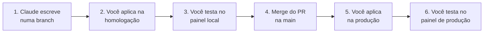

# Plano de trabalho

O mapa de tudo o que falta fazer, na ordem, para não perder nenhuma etapa. Cada etapa diz **onde**
a mudança acontece, **como testar** e **como levar para a produção**. Marque `[x]` ao concluir.

A análise que originou a lista está em [analise-topologia.md](analise-topologia.md).

## Onde estamos

| Peça | O que é | Situação |
|---|---|---|
| Máquina Linux no Mac | Onde você roda o painel, os comandos do Supabase e os scripts | Pronta |
| Homologação | Projeto Supabase `infoxtec-escalas-dev` (`oruwnlxyvznpigbpjjbx`), com dados fictícios, sem WhatsApp nem ligações reais | Pronta, com as migrations 01 a 43 |
| Produção | Projeto Supabase `infoxtec-escalas` (`zpckrxydqqmmcrphrkxz`) + painel na Vercel | Com as migrations 01 a 43 e o painel 3.2 |
| Repositório | GitHub `infoxtec/infoxtec-escalas`. A `main` é o que vale para a produção | `main` igual à produção desde o merge do PR #1 (26/09) |

## Regras combinadas (26/09)

| Tipo de mudança | Caminho |
|---|---|
| **Registro no backlog** | Vai direto para a produção, feito pelo Claude, só na tabela do backlog. Numeração automática em sequência única: 001, 002... |
| **Qualquer outra mudança** (banco, painel, Edge Functions) | Claude aplica na homologação, vocês dois testam, e só com o seu comando vai para a produção, pelo ciclo abaixo |

## O ciclo de toda mudança

Sempre o mesmo caminho, sem atalho:

| Passo | Quem | Comando ou ação |
|---|---|---|
| 1 | Claude Code | Escreve a migration ou o código numa branch e abre o pull request |
| 2 | Você, no Linux | `cd ~/infoxtec-escalas && git fetch && git checkout <branch> && git pull` e depois `./scripts/aplicar-homologacao.sh` |
| 3 | Você | `./scripts/painel.sh iniciar` (fica no ar com o terminal fechado) e o teste descrito na etapa |
| 4 | Você, no GitHub | Aprovar e fazer o merge do pull request |
| 5 | Você, no Linux | `git checkout main && git pull` e depois `./scripts/aplicar-producao.sh` |
| 6 | Você | O mesmo teste do passo 3, no painel de produção |

**Nunca rode SQL direto na produção**, nem os comandos `supabase migration repair` ou
`supabase db pull` que o Supabase sugere quando algo dá errado. Se algo falhar, pare e traga a
mensagem completa.

### Os dois scripts

| Script | O que faz | Travas |
|---|---|---|
| `scripts/aplicar-homologacao.sh` | Liga na homologação, mostra a situação das migrations e aplica | Confere que o link ficou na homologação antes de aplicar |
| `scripts/aplicar-producao.sh` | Liga na produção, mostra o que vai ser aplicado e só aplica se você digitar `PRODUCAO` | Recusa rodar fora da `main`, com arquivo alterado ou com a `main` desatualizada; ao terminar, sempre volta o link para a homologação |

Painel de produção sem banco novo (só mudança de tela): o passo 5 é o próprio merge, porque a
Vercel publica a `main` sozinha.

## Etapas

As etapas estão em ordem. Dentro de cada bloco, uma etapa só começa quando a anterior terminou.

### Bloco 1: fechar o que já foi feito

- [x] **1. Confirmar 39 a 41 em produção.** No Linux: `npx supabase link --project-ref zpckrxydqqmmcrphrkxz`, `npx supabase migration list` (39, 40 e 41 precisam aparecer em Remote) e voltar com `npx supabase link --project-ref oruwnlxyvznpigbpjjbx`.
      *Teste no painel de produção:* abrir um documento enviado por arquivo; criar uma habilidade; marcar as habilidades de um técnico. Os três falhavam antes.
- [x] **2. Agendar a limpeza de logs na produção.** No SQL Editor da produção, rodar a última linha de `supabase/setup/cron.sql`. É a única exceção à regra de não rodar SQL na produção, porque agendamento não é migration.
- [x] **3. Merge do pull request e aplicação na produção.** Leva para a produção o que ainda está só na homologação:
      - migration 42: itens de documentos no backlog;
      - migration 43: backlog numerado em sequência (001, 002...);
      - painel 3.2: números com três dígitos e a faixa de ambiente no painel local.

      Como: no GitHub, *Merge pull request*; a Vercel publica o painel sozinha. No Linux, `git checkout main && git pull` e `./scripts/aplicar-producao.sh`.
      *Teste:* na aba Roadmap da produção, todos os itens com número de três dígitos, sem repetição, e os três de documentos no fim da lista do backlog. A partir daqui, a `main` é igual à produção.

### Bloco 2: ambiente e processo (configuração, sem código)

- [x] **4. Preview da Vercel apontando para a homologação.** Feito com `scripts/configurar-vercel-homologacao.sh`: Production usa a produção; Preview e Development usam a homologação.
      *Teste:* abrir o preview de um PR e conferir que só aparecem os dados fictícios.
- [ ] **5. Login da homologação.** Supabase dev → Authentication → URL Configuration: incluir `http://localhost:5173/**` e `https://*.vercel.app/**`; desligar o cadastro público.
- [ ] **6. Senha forte, sem custo.** A proteção nativa do Supabase é paga, então fica em duas partes gratuitas:
      - *Configuração (você):* nos dois projetos, Authentication → tamanho mínimo de senha **12**.
      - *Código (Claude, pelo ciclo):* ao criar ou trocar a senha, o painel consulta a base pública de senhas vazadas (Have I Been Pwned). Só os 5 primeiros caracteres do *hash* da senha saem do navegador; a senha nunca. Senha encontrada é recusada.
      *Teste:* tentar cadastrar `Senha@123456` e ver a recusa.

### Bloco 3: banco (cada uma é uma migration: homologação, teste, produção)

- [ ] **7. Alerta de motor parado.** *Migration 44 e painel 3.3 aplicados na homologação em 26/09; aguardando teste conjunto e sua ordem.* Se o motor não rodar com sucesso por mais de 5 minutos, os supervisores recebem aviso, e a aba Operação mostra a última execução.
      *Teste na homologação:* simular falha do motor e ver o alerta registrado.
- [ ] **8. Validação dos parâmetros (`config`).** Gravar um valor inválido (por exemplo, texto em `max_tentativas`) passa a ser recusado, em vez de quebrar o motor.
- [ ] **9. Limpeza do legado.** Remover as funções da bancada de teste (`fn_teste_wa_*`) e o índice duplicado `idx_notif_wa`.
- [ ] **10. Decisão de negócio: fechar escalas passadas.** Hoje uma escala confirmada fica "confirmada" para sempre. Decidir se passa a ser concluída automaticamente depois do término previsto. Só vira migration depois da sua decisão.

### Bloco 4: segurança das Edge Functions

- [ ] **11. `documento-ocr` valida o login por conta própria**, sem depender só da configuração de publicação.
- [ ] **12. `voz-escala` confere a assinatura da Twilio** (`X-Twilio-Signature`) em vez de confiar só no token da URL.
- [ ] **13. Trocar a biblioteca `xlsx`** da importação de planilhas, que tem vulnerabilidade alta sem correção no npm.
      *Teste:* importar a mesma planilha antes e depois.

Edge Function não é migration: é publicada com `npx supabase functions deploy <nome>`, primeiro no projeto dev e depois no de produção, pelo mesmo ciclo.

### Bloco 5: proteção automática

- [ ] **14. CI no GitHub.** Em todo pull request: compilar o painel, reaplicar todas as migrations num banco vazio e rodar o `plpgsql_check`. Pega sozinho os erros que nesta análise foram encontrados à mão.
- [ ] **15. Testes automáticos das regras críticas** (pgTAP): fuso do motor, jornada CLT, permissões por papel, habilidades.

### Bloco 6: infraestrutura sem custo

Regra (decisão 29): nenhuma assinatura paga. Cada item abaixo usa só planos gratuitos.

- [ ] **16. Desligar o Retool.** Quem tem edição lá executa SQL na produção sem passar por nada deste plano.
- [ ] **17. Painel no Cloudflare Pages (gratuito).** O plano gratuito da Vercel proíbe uso comercial; o do Cloudflare Pages permite, também publica a `main` sozinho e tem preview por branch.
      *Como:* criar o projeto no Cloudflare ligado ao GitHub (pasta `web`, comando `npm run build`, saída `dist`), cadastrar as variáveis de produção e de preview, converter os cabeçalhos de segurança do `vercel.json` para o arquivo `_headers`, e atualizar os endereços de login no Supabase.
      *Teste:* o painel abre no endereço novo, com login, e a Vercel só é desligada depois de uma semana rodando em paralelo.
- [ ] **18. Backup diário gratuito.** O Supabase gratuito não tem backup com restauração pelo painel. Substituto: toda madrugada, o GitHub Actions (gratuito em repositório privado) faz uma cópia completa do banco de produção, criptografada com uma senha que só você guarda, e mantém as últimas 30.
      *Teste de restauração:* uma vez por mês, o mesmo robô restaura a cópia mais recente num banco temporário, confere as contagens e apaga o banco. Os dados reais nunca vão para a homologação (LGPD).

### Bloco 7: gestão de documentos (backlog 14 a 16)

Pedidos em 26/09. Análise em [backlog.md](backlog.md), itens 14 a 16. Envolvem banco (migration) e painel (tela), pelo mesmo ciclo. As decisões pendentes precisam de resposta antes de começar.

- [ ] **19. Pré-visualização e download com aviso de LGPD** (backlog 15). Vem primeiro porque as outras duas usam o visualizador.
      *Teste:* enviar um PDF e uma foto e ver o documento ao lado dos campos; baixar um documento e conferir o aviso e o registro do download.
- [ ] **20. Classificação obrigatória: ASO, NR, suspensão ou advertência** (backlog 16).
      *Decidir antes:* quem vê suspensão e advertência; se CNH continua como categoria.
      *Teste:* tentar gravar um documento sem categoria e ver a recusa; classificar os antigos pela lista.
- [ ] **21. Identificação automática do tipo e do técnico** (backlog 14).
      *Decidir antes:* se o cadastro passa a ter CPF.
      *Teste:* enviar uma pasta com documentos de técnicos diferentes e conferir as sugestões.

### Bloco 8: arquitetura (projetos maiores)

- [ ] **22. WhatsApp pela API oficial da Meta**, com a fila de saída e o adaptador descritos na decisão 26. É o item 1 do Bloco 1 de [segurança e homologação](seguranca-homologacao.md).
- [ ] **23. Início da escala como instante (`timestamptz`)**, eliminando a classe de erro de fuso na raiz.

## Registro

| Data | Etapa | Homologação | Produção |
|---|---|---|---|
| 26/09 | Migrations 39, 40 e 41 | Aplicadas e testadas | Aplicadas e testadas (Bloco 1) |
| 26/09 | Limpeza de logs agendada | Não se aplica | Agendada |
| 26/09 | Migration 42: itens de documentos no backlog | Aplicada e testada | Aplicada e conferida |
| 26/09 | Migration 43 + painel 3.2: numeração 001 do backlog | Aplicada e testada | Aplicada e conferida |
| 26/09 | Merge do PR #1: `main` igual à produção | Não se aplica | Concluído |
| 26/09 | Vercel: Preview e Development na homologação | Configurado | Production sem alteração |
| 26/09 | Migration 44 + painel 3.3: alerta de motor parado | Aplicada e testada | Aguardando sua ordem |
