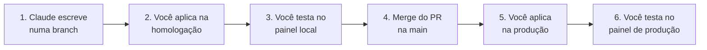

# Plano de trabalho

O mapa de tudo o que falta fazer, na ordem, para não perder nenhuma etapa. Cada etapa diz **onde**
a mudança acontece, **como testar** e **como levar para a produção**. Marque `[x]` ao concluir.

A análise que originou a lista está em [analise-topologia.md](analise-topologia.md); a revisão global de 27/09, com as prioridades consolidadas, em [analise-global.md](analise-global.md).

## Onde estamos

| Peça | O que é | Situação |
|---|---|---|
| Máquina Linux no Mac | Onde você roda o painel, os comandos do Supabase e os scripts | Pronta |
| Homologação | Projeto Supabase `infoxtec-escalas-dev` (`oruwnlxyvznpigbpjjbx`), com dados fictícios, sem WhatsApp nem ligações reais | **Migrations 01 a 50** e as três Edge Functions — igual à produção desde 28/09 |
| Produção | Projeto Supabase `infoxtec-escalas` (`zpckrxydqqmmcrphrkxz`) + painel na Vercel | **Migrations 01 a 50** (28/09), as três Edge Functions e o painel 3.5.2 |
| Repositório | GitHub `infoxtec/infoxtec-escalas`. A `main` é o que vale para a produção | `main` igual à produção e à homologação desde 28/09 (migrations 01 a 50) |

## Regras combinadas (26/09)

| Tipo de mudança | Caminho |
|---|---|
| **Registro no backlog** | Vai direto para a produção, feito pelo Claude, só na tabela do backlog. Numeração automática em sequência única: 001, 002... |
| **Qualquer outra mudança** (banco, painel, Edge Functions) | Claude aplica na homologação, vocês dois testam, e só com o seu comando vai para a produção, pelo ciclo abaixo |

## O ciclo de toda mudança

Sempre o mesmo caminho, sem atalho:

```mermaid
flowchart LR
    A[1. Claude escreve<br/>numa branch] --> B[2. Você aplica na<br/>homologação]
    B --> C[3. Você testa no<br/>painel local]
    C --> D[4. Merge do PR<br/>na main]
    D --> E[5. Você aplica<br/>na produção]
    E --> F[6. Você testa no<br/>painel de produção]
```

| Passo | Quem | Comando ou ação |
|---|---|---|
| 1 | Claude Code | Escreve a migration ou o código numa branch e abre o pull request |
| 2 | Você, no Linux | `cd ~/infoxtec-escalas && git fetch && git checkout <branch> && git pull` e depois `./scripts/aplicar-homologacao.sh` |
| 3 | Você | `./scripts/painel.sh iniciar` (fica no ar com o terminal fechado) e o teste descrito na etapa |
| 4 | Você, no GitHub | Aprovar e fazer o merge do pull request |
| 5 | Você, no Linux | `git checkout main && git pull` e depois `./scripts/aplicar-producao.sh` |
| 6 | Você | O mesmo teste do passo 3, no painel de produção |

**Nunca rode SQL direto na produção**, nem os comandos `supabase migration repair` ou
`supabase db pull` que o Supabase sugere quando algo dá errado. Se algo falhar, pare e traga a
mensagem completa.

### Os dois scripts

| Script | O que faz | Travas |
|---|---|---|
| `scripts/aplicar-homologacao.sh` | Liga na homologação, mostra a situação das migrations e aplica | Confere que o link ficou na homologação antes de aplicar |
| `scripts/aplicar-producao.sh` | Liga na produção, mostra o que vai ser aplicado e só aplica se você digitar `PRODUCAO` | Recusa rodar fora da `main`, com arquivo alterado ou com a `main` desatualizada; ao terminar, sempre volta o link para a homologação |

Painel de produção sem banco novo (só mudança de tela): o passo 5 é o próprio merge, porque a
Vercel publica a `main` sozinha.

## Etapas

As etapas estão em ordem. Dentro de cada bloco, uma etapa só começa quando a anterior terminou.

### Bloco 1: fechar o que já foi feito

- [x] **1. Confirmar 39 a 41 em produção.** No Linux: `npx supabase link --project-ref zpckrxydqqmmcrphrkxz`, `npx supabase migration list` (39, 40 e 41 precisam aparecer em Remote) e voltar com `npx supabase link --project-ref oruwnlxyvznpigbpjjbx`.
      *Teste no painel de produção:* abrir um documento enviado por arquivo; criar uma habilidade; marcar as habilidades de um técnico. Os três falhavam antes.
- [x] **2. Agendar a limpeza de logs na produção.** No SQL Editor da produção, rodar a última linha de `supabase/setup/cron.sql`. É a única exceção à regra de não rodar SQL na produção, porque agendamento não é migration.
- [x] **3. Merge do pull request e aplicação na produção.** Leva para a produção o que ainda está só na homologação:
      - migration 42: itens de documentos no backlog;
      - migration 43: backlog numerado em sequência (001, 002...);
      - painel 3.2: números com três dígitos e a faixa de ambiente no painel local.

      Como: no GitHub, *Merge pull request*; a Vercel publica o painel sozinha. No Linux, `git checkout main && git pull` e `./scripts/aplicar-producao.sh`.
      *Teste:* na aba Roadmap da produção, todos os itens com número de três dígitos, sem repetição, e os três de documentos no fim da lista do backlog. A partir daqui, a `main` é igual à produção.

### Bloco 2: ambiente e processo (configuração, sem código)

- [x] **4. Preview da Vercel apontando para a homologação.** Feito com `scripts/configurar-vercel-homologacao.sh`: Production usa a produção; Preview e Development usam a homologação.
      *Teste:* abrir o preview de um PR e conferir que só aparecem os dados fictícios.
- [ ] **5. Login da homologação.** Supabase dev → Authentication → URL Configuration: incluir `http://localhost:5173/**` e `https://*.vercel.app/**`; desligar o cadastro público.
- [x] **6. Senha forte, sem custo.** *Concluída em 27/09: mínimo de 8 caracteres com letras e números nos dois projetos (decisão 36) e recusa de senha vazada no painel.*
      - *Configuração (você):* nos dois projetos, Authentication → tamanho mínimo de senha **12**.
      - *Código (Claude, pelo ciclo):* **feito no painel 3.4 (PR #3).** Ao criar ou trocar a senha, o painel consulta a base pública de senhas vazadas (Have I Been Pwned). Só os 5 primeiros caracteres do *hash* da senha saem do navegador; a senha nunca. Senha encontrada é recusada.
      *Teste:* tentar cadastrar `Senha@123456` e ver a recusa.

### Bloco 3: banco (cada uma é uma migration: homologação, teste, produção)

- [x] **7. Alerta de motor parado.** *Na produção desde 27/09: migration 44 e agendamento `vigia-motor`.* Se o motor não rodar com sucesso por mais de 5 minutos, os supervisores recebem aviso, e a aba Operação mostra a última execução.
      *Teste na homologação:* simular falha do motor e ver o alerta registrado.
      *Passo manual na produção, depois do script:* no SQL Editor da produção, rodar a linha `vigia-motor` de `supabase/setup/cron.sql`. Sem ela o alerta nunca dispara; a aba Operação avisa quando o vigia não está agendado.
- [x] **8. Validação dos parâmetros (`config`).** *Na produção desde 27/09 (PR #3).* Gravar um valor inválido (por exemplo, texto em `max_tentativas`) passa a ser recusado, em vez de quebrar o motor.
- [x] **9. Limpeza do legado.** *Na produção desde 27/09 (PR #3).* Remover as funções da bancada de teste (`fn_teste_wa_*`) e o índice duplicado `idx_notif_wa`.
- [x] **10. Fechar escalas passadas e liberar o horário da recusa.** *Na produção desde 27/09 (PR #3).* Decidido em 27/09 (decisões 30 e 31): confirmada vira concluída 5 minutos depois do término previsto; recusa libera o horário e o técnico volta para "sem escala".
      *Teste:* escala confirmada que terminou há mais de 5 minutos aparece como concluída; criar uma escala no mesmo horário de uma recusada é aceito.
- [x] **10b. Robustez do banco** (análise global, 27/09). *Na produção desde 27/09 (PR #3).* Índices nas chaves estrangeiras (excluir técnico com 260 escalas: de 3,5 s para 0,04 s), trava contra motor em dobro, apagar o conteúdo enviado das notificações depois de 90 dias.
- [ ] **10c. Avisos técnicos por dois caminhos** (decisão 34). *WhatsApp de aviso técnico na produção desde 27/09 (PR #3); falta criar o monitor no healthchecks.io ([roteiro](roteiro-producao.md), D5).* WhatsApp pela Evolution para os supervisores e para David Cerqueira (motor parado, banco perto do limite) e monitor externo gratuito (healthchecks.io) por e-mail e Telegram para quando a Evolution ou o Supabase caem.

### Bloco 4: segurança das Edge Functions

- [x] **11. `documento-ocr` valida o login por conta própria**, sem depender só da configuração de publicação. *Na produção desde 27/09 (PR #3).* Corrigido junto: o botão de leitura na nuvem falhava sempre no navegador (faltava CORS) e a chave do Google podia vazar numa mensagem de erro.
- [ ] **12. `voz-escala` confere a assinatura da Twilio** (`X-Twilio-Signature`) em vez de confiar só no token da URL. *Na produção desde 27/09, em observação; falta ligar o bloqueio.* Começa em observação; o bloqueio é ligado depois de conferir o log ([telefonia.md](telefonia.md)). **Prazo:** ligar o bloqueio depois de 10 ligações reais com `assinatura da Twilio ok` no log, no máximo 30 dias após a publicação; até lá a proteção continua sendo só o token.
- [x] **13. Trocar a biblioteca `xlsx`** da importação de planilhas. *Na produção desde 27/09 (painel 3.4.2, PR #8): xlsx 0.20.3 oficial guardado em `web/vendor/` (decisão 37), zero vulnerabilidades; o CI bloqueia vulnerabilidade alta.*
      *Teste:* importar a mesma planilha antes e depois.

Edge Function não é migration: é publicada com `npx supabase functions deploy <nome>`, primeiro no projeto dev e depois no de produção, pelo mesmo ciclo.

### Bloco 5: proteção automática

- [x] **14. CI no GitHub.** *Valendo desde o merge do PR #3 (27/09).* Em todo pull request: compilar o painel, reaplicar todas as migrations num banco vazio e rodar o `plpgsql_check`. Pega sozinho os erros que nesta análise foram encontrados à mão.
- [ ] **15. Testes automáticos das regras críticas** (pgTAP): fuso do motor, jornada CLT, permissões por papel, habilidades.

### Bloco 6: infraestrutura sem custo

Regra (decisão 29): nenhuma assinatura paga. Cada item abaixo usa só planos gratuitos.

- [x] **16. Desligar o Retool.** *Concluída em 27/09: senha do banco de produção trocada e conexão `infoxtec-escalas` apagada no Retool (conferido). O Retool não alcança mais o banco; os apps antigos que restam lá não têm dados.*
- [x] **17a. Evolution própria na Oracle Cloud (decisão 43).** *Concluída em 30/09: uma só Evolution 2.4 no servidor, antiga desligada (backlog 071 e 073).* *Servidor no ar em 28/09 (Oracle São Paulo, `VM.Standard.E2.1.Micro`, 163.176.68.206), número 71 4101-9605 conectado na instância `infoxtec` e envio testado; virada feita em 28/09 (2.4.0-rc2, botões ligados); falta desligar a antiga (parte F) e consolidar o servidor numa versão.* Fecha `SEG-01` e `SEG-02`.
- [ ] **17. Painel no Cloudflare Pages (gratuito).** O plano gratuito da Vercel proíbe uso comercial; o do Cloudflare Pages permite, também publica a `main` sozinho e tem preview por branch.
      *Como:* criar o projeto no Cloudflare ligado ao GitHub (pasta `web`, comando `npm run build`, saída `dist`), cadastrar as variáveis de produção e de preview, converter os cabeçalhos de segurança do `vercel.json` para o arquivo `_headers`, e atualizar os endereços de login no Supabase.
      *Teste:* o painel abre no endereço novo, com login, e a Vercel só é desligada depois de uma semana rodando em paralelo.
- [x] **18. Backup diário gratuito.** *Funcionando desde 27/09: primeiro backup da produção (80 KB, criptografado) e teste de restauração conferido (13 técnicos, 8 locais, 47 escalas, 91 notificações, 1 documento, 3 usuários, 60 itens de backlog).* O Supabase gratuito não tem backup com restauração pelo painel. Substituto: toda madrugada, o GitHub Actions (gratuito em repositório privado) faz uma cópia completa do banco de produção, criptografada com uma senha que só você guarda, e mantém as últimas 30.
      *Teste de restauração:* uma vez por mês, o mesmo robô restaura a cópia mais recente num banco temporário, confere as contagens e apaga o banco. Os dados reais nunca vão para a homologação (LGPD).

### Bloco 7: gestão de documentos (backlog 14 a 16)

Pedidos em 26/09. Análise em [backlog.md](backlog.md), itens 14 a 16. Envolvem banco (migration) e painel (tela), pelo mesmo ciclo. As decisões pendentes precisam de resposta antes de começar.

- [ ] **19. Pré-visualização e download com aviso de LGPD** (backlog 15). Vem primeiro porque as outras duas usam o visualizador.
      *Teste:* enviar um PDF e uma foto e ver o documento ao lado dos campos; baixar um documento e conferir o aviso e o registro do download.
- [ ] **20. Classificação obrigatória: ASO, NR, suspensão ou advertência** (backlog 16). *Decidido em 27/09 (decisão 32): suspensão e advertência só para administradores, guardadas 3 anos; CNH continua.*
      *Decidir antes:* quem vê suspensão e advertência; se CNH continua como categoria.
      *Teste:* tentar gravar um documento sem categoria e ver a recusa; classificar os antigos pela lista.
- [ ] **21. Identificação automática do tipo e do técnico** (backlog 14). *Decidido em 27/09 (decisão 32): o cadastro passa a ter CPF.*
      *Decidir antes:* se o cadastro passa a ter CPF.
      *Teste:* enviar uma pasta com documentos de técnicos diferentes e conferir as sugestões.

### Bloco 8: arquitetura (projetos maiores)

- [ ] ~~**22. WhatsApp pela API oficial da Meta.**~~ *Fora do plano (decisão 33, 27/09): a Evolution continua; mitigação na etapa 10c e na contingência de `operacao.md`.*
- [ ] **23. Início da escala como instante (`timestamptz`)**, eliminando a classe de erro de fuso na raiz.

### Pendências da revisão de segurança do PR #3 (baixas)

- [ ] `monitor_ping_url` aceitar só `https://hc-ping.com/<uuid>`.
- [ ] `webhook-evolution` recusar corpo sem `content-length` (411) antes de ler.
- [ ] CORS da `documento-ocr` limitado aos domínios do painel.
- [ ] Registrar em `decisoes.md` que o GitHub guarda cópia cifrada dos dados (tratamento LGPD).

### Bloco 9: produto (análise global de 27/09, aprovado pelo responsável)

- [x] **24. Motivo de recusa estruturado e tempo de resposta** (backlog 064). *Na produção desde 28/09 (migrations 47 e 48, painel 3.5, PR #12) — e o motivo de saúde saiu do sistema na migration 49 (decisão 40).* (fase 0 de [agente-ia.md](agente-ia.md)). Base dos indicadores: sem ela, cada semana é dado perdido.
- [x] **25. Editar e reagendar escala** (backlog 065). *Na produção desde 28/09 (migrations 47 e 48, painel 3.5, PR #12)*, com "substituir técnico" depois de uma recusa.

## Registro

| Data | Etapa | Homologação | Produção |
|---|---|---|---|
| 26/09 | Migrations 39, 40 e 41 | Aplicadas e testadas | Aplicadas e testadas (Bloco 1) |
| 26/09 | Limpeza de logs agendada | Não se aplica | Agendada |
| 26/09 | Migration 42: itens de documentos no backlog | Aplicada e testada | Aplicada e conferida |
| 26/09 | Migration 43 + painel 3.2: numeração 001 do backlog | Aplicada e testada | Aplicada e conferida |
| 26/09 | Merge do PR #1: `main` igual à produção | Não se aplica | Concluído |
| 26/09 | Vercel: Preview e Development na homologação | Configurado | Production sem alteração |
| 26/09 | Migration 44 + painel 3.3: alerta de motor parado, logomarca, painel em segundo plano | Aplicada e testada pelo Claude; teste conjunto pendente | Aguardando sua ordem |
| 27/09 | Merge do PR #2: painel 3.3 (alerta de motor, logomarca) | Não se aplica | Painel publicado; migration 44 pendente |
| 27/09 | Migrations 45 e 46, Edge Functions, CI, backup, painel 3.4 (etapas 8 a 12, 14, 18, 10b, 10c) | Aplicadas e testadas; teste conjunto aprovado | Aplicadas pelo responsável (migrations 44 a 46, Edge Functions, `vigia-motor`) e conferidas |
| 27/09 | Painel 3.4.1: sessão não cai mais sozinha (decisão 35, PR #4) | Testado em navegador com duas abas | Publicado |
| 27/09 | Backup diário e teste de restauração (etapa 18, PR #6) | Não se aplica | Primeiro backup e restauração conferidos |
| 27/09 | Painel 3.4.2: senha 8 com letras e números (etapa 6) e xlsx 0.20.3 (etapa 13) | Testado (importação xlsx, xls e csv) | Publicado (PR #8) |
| 27/09 | Retool desligado (etapa 16): senha do banco trocada, conexão apagada | Não se aplica | Conferido |
| 27/09 | Migrations 47 e 48 + painel 3.5: motivo de recusa (064) e editar/substituir escala (065) | Aplicada e testada; plpgsql_check zero | Aguardando ordem |
| 28/09 | Migrations 47, 48 e 49 na produção (o script aplicou as três de uma vez) | Sem teste conjunto prévio: aplicado direto pelo responsável, a pedido, com as duas consultas de dependência do tipo conferidas antes | **Produção em 01 a 49** |
| 28/09 | Migration 49 + painel 3.5.1: sem motivo de saúde na recusa (decisão 40) e sem vínculo por Google Drive (decisão 41) | Pendente o teste de ponta a ponta no painel | Produção; **falta aplicar a 49 na homologação** |
| 28/09 | Convergência dos ambientes: a migration 49 chegou à homologação | Não se aplica | Homologação em 49, igual à produção |
| 28/09 | Migration 50 + painel 3.5.2: o modo Drive sai da estrutura — colunas, view e três funções (decisão 42) | Testado: selo "Privado", envio e abertura de arquivo, e as duas consultas de verificação | **Produção e homologação em 01 a 50** |
| 28/09 | Evolution própria: `infra/evolution/` e roteiro (decisão 43) | Não se aplica | Aguardando o servidor na Oracle |
| 28/09 | Evolution própria no ar (E2.1.Micro, sem Redis) e número conectado; parte D concluída | Envio de teste entregue | Falta a virada (parte E) |
| 28/09 | Virada da produção (parte E): SEG-01 e SEG-02 fechados; Evolution 2.4.0-rc2 com botões | Escala de teste enviada em 26 s e confirmada | Falta parte F (desligar a vluma) e consolidar o servidor |
| 29/09 | Migration 51 + painel 3.6.0: Administração do Sistema > Checklist (saúde de Evolution, Supabase, tabelas, Twilio, GitHub, Vercel) | Homologação: plpgsql_check zero, 13 itens, limite de 10 s; revisão do `seguranca` sem bloqueio | Aguardando teste conjunto e ordem |
| 30/09 | Consolidação do servidor Evolution (backlog 073): 2.4 única, 2.3.7 e aparelhos antigos desligados | Checklist open, escala de teste enviada e confirmada | Concluído; falta a limpeza e o reinício do servidor |
| 30/09 | Migration 52: índices das 5 chaves estrangeiras; homologação alinhada à produção (trava 20260928235626) | Homologação: plpgsql_check zero; linter sem chave estrangeira sem índice | Aguardando merge e aplicação na produção |
